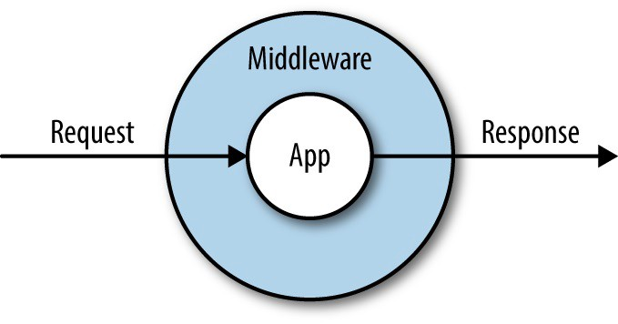

<center>

# Backend


</center>


## Introducción

El presente documento tiene como objeto principal establecer la documentación de los controladores, las entidades, helpers, middlewares y rutas utilizadas en la aplicación en la parte del backend. Este proyecto utiliza NodeJS, TypeScript y TYPEORM con base de datos MYSQL.

## Versión de Node

* Node v14.17.5
* Package Manager: npm 7.21.1
* OS: win32 x64

**Para más información acerca de las dependecias utilizadas en el proyecto, entre otras cosas, puedes consultar la carpeta backend del repositorio haciendo click [aquí](https://github.com/dev36aiatic/primerosPasosAngular)**

## Archivo index.ts

Este archivo es el que consume todas las funcionalidades de la aplicación, aquí se establece la conexión a la base de datos relacional, las rutas creadas, verificación del token de Facebook para mantener la sesión iniciada, etc.

**Código del archivo index.ts**

```Typescript
import "reflect-metadata";
import { createConnection } from "typeorm";
import * as express from "express";
import * as dotenv from 'dotenv';
import * as morgan from 'morgan';
import * as cors from 'cors';
import router from './routes/auth';
import * as passport from 'passport';
import * as path from 'path';
import * as FacebookTokenStrategy from 'passport-facebook-token';
import { getRepository } from "typeorm";
import { SocialUser } from "./entity/GoogleOrFbUser";
import { Profile } from './entity/Profile';

/**Se establece la conxion a la base de datos relacional */
createConnection().then(async () => {

    /**Se crea la aplicacion de express */
    const app = express();

    /**Leer archivo de variables de entorno .env */
    dotenv.config();

    /**Configuracion de las peticiones http permitidas */
    app.use(cors());

    /** Middleware que me analiza el json enviado */
    app.use(express.json());

    /**Definicion del puerto del servidor */
    app.set('port', process.env.PORT || 5050);

    /**Leer peticiones de rutas */
    app.use(morgan('tiny'));

    /**
     * Verifica si el token enviado por Facebook es valido
     * @property {string} clientID - Identificador de la app para el login con facebook 
     * @property {string} clientSecret - Llave secreta de la app para el login con facebook 
     * @param {string} accessToken - Token
     * @param {string} refreshToken - Token opcional para refrescar el accessToken
     * @param {Object} profile - El usuario que envia facebook para la autenticacion
     */

    passport.use(new FacebookTokenStrategy({
        clientID: process.env.FACEBOOK_CLIENT_ID,
        clientSecret: process.env.FACEBOOK_CLIENT_SECRET,
        fbGraphVersion: 'v3.0'
    }, async function (accessToken, refreshToken, profile, done) {
        const socialUserRepository = getRepository(SocialUser);
        const profileRepository = getRepository(Profile);
        let dbUser = await socialUserRepository.findOne({ idFb: profile.id });

        if (dbUser == null) {
            const { name, email, id } = profile._json;
            let dbProfile = new Profile();
            dbProfile.skills = [];
            await profileRepository.save(dbProfile);

            dbUser = new SocialUser();
            dbUser.name = name;
            dbUser.email = email;
            dbUser.idFb = id;
            dbUser.profile = dbProfile;
            dbUser.provider = "FACEBOOK";
            await socialUserRepository.save(dbUser);
        }
        return done((dbUser == null), dbUser, accessToken);
    }
    ));

    /**Se le dice al servidor que use los archivos que estan en la carpeta public */
    app.use(express.static(path.join(__dirname + '/public')));

    /**La app de express toma las rutas establecidas en el modulo de router*/
    app.use('/', router);

    /**La app de express escucha el puerto establecido en la variable port */
    app.listen(app.get('port'), () => {
        console.log(`Servidor corriendo en el puerto ${app.get('port')}`);
    });

}).catch(error => console.log(error));

```

<center>

## Controladores


</center>


Los controladores son propiedades que están contenidas dentro de un objeto JSON, estas propiedades permiten interactuar con la base de datos, por ejemplo: Permite la creación de usuarios, perfiles, iniciar sesión, etc.

**Código de los controladores**

```Typescript
import { response, request } from "express";
import { getRepository } from "typeorm";
import { User } from "../entity/User";
import { SocialUser } from '../entity/GoogleOrFbUser';
import * as jwt from 'jsonwebtoken';
import * as bcrypt from 'bcryptjs';
import generateJWT from '../helpers/generateJWT';
import userInfo from '../helpers/user-info';
import { Profile } from '../entity/Profile';
import { OAuth2Client } from 'google-auth-library';
import * as passport from 'passport';
import deleteImage from '../helpers/delete-prev-image';
import * as fs from 'fs'
import * as path from 'path';

/** Creacion del OAuth2Client de google para autenticacion */
const client = new OAuth2Client(process.env.GOOGLE_CLIENT_ID);

/** Controlador de las funciones ejecutadas cuando se hacen peticiones http*/
const authController = {
    /**Funcion para crear usuarios y guardarlos en la base de datos 
     * @param req - Informacion de la solicitud HTTP provocada
     * @param res - Permite devolver la respuesta HTTP 
     * @function getRepository - Funcion que trae la información de la tabla almacenada en la base de datos
     * @returns - Información del usuario y token
     * */
    newUser: async (req, res = response) => {
        const userRepository = getRepository(User);
        const profileRepository = getRepository(Profile);
        const { name, email, password } = req.body;

        try {
            //Buscar si existe el usuario en la bd
            let dbUser = await userRepository.findOne({ email });

            if (dbUser) {
                return res.status(400).json({
                    ok: false,
                    msg: 'Ya existe un usuario con este correo.'
                })
            }
            /**
             * Crea un nuevo perfil
             * @class
             */
            let profile = new Profile();
            profile.skills = [];
            await profileRepository.save(profile);
            
            /**
             * Crea un nuevo Usuario
             * @class
             */
            let newUser = new User();
            newUser.name = name;
            newUser.email = email;
            newUser.profile = profile;
            const salt = bcrypt.genSaltSync();
            newUser.password = bcrypt.hashSync(password, salt);
            await userRepository.save(newUser);

            const findUser = await userRepository.findOne({ email });
            const token = await generateJWT(findUser.user_id, findUser.name);

            res.status(200).json({
                ok: true,
                user: userInfo(findUser),
                token
            })
        } catch (error) {
            console.log(error);
            res.status(500).json({
                ok: false,
                msg: 'Lo sentimos, algo salio mal.'
            })
        }
    },
    /**
     * Funcion para añadir el perfil del usuario en la base de datos
     * @param req - Informacion de la solicitud HTTP provocada
     * @param res - Permite devolver la respuesta HTTP 
     * @function getRepository - Funcion que me trae la tabla de la base de datos
     * @returns - Usuario actualizado
     */
    updateProfile: async (req, res = response) => {
        const { id, provider } = req.params;
        const { name, cc, address, dateOfBirth,
            city, department, country, ZIP,
            profession, skills, description } = req.body;

        try {
            const userRepository = getRepository(User);
            const socialUserRepository = getRepository(SocialUser);
            const profileRepository = getRepository(Profile);
            
        

            let dbUser: User | SocialUser;

            if (provider == "GOOGLE" || provider == "FACEBOOK") {
                dbUser = await socialUserRepository.findOne({ user_id: id });
            } else {
                dbUser = await userRepository.findOne({ user_id: id });
            }

            
            let ProfileCC = await profileRepository.findOne({ cc });
            let profile_id = dbUser.profile.profile_id;
          
            if(ProfileCC){
                if(ProfileCC.profile_id != profile_id){
                    return res.status(400).json({
                        ok: false,
                        msg: 'Ya existe un usuario con esta cédula.'
                    });
                }
            }

            let dbProfile = await profileRepository.findOne({ profile_id });
            dbUser.name = name;
            dbProfile.cc = cc;
            dbProfile.address = address;
            dbProfile.dateOfBirth = dateOfBirth;
            dbProfile.city = city;
            dbProfile.department = department;
            dbProfile.country = country;
            dbProfile.ZIP = ZIP;
            dbProfile.profession = profession;
            dbProfile.skills = skills;
            dbProfile.description = description;
            dbUser.profile = dbProfile;

            await profileRepository.save(dbProfile);

            if (provider == "GOOGLE" || provider == "FACEBOOK") {
                await socialUserRepository.save(dbUser);
            } else {
                await userRepository.save(dbUser);
            }

            return res.status(200).json({
                ok: true,
                user: userInfo(dbUser),
                msg: 'Los cambios se han realizado.'
            });

        } catch (error) {
            console.log(error);
            return res.status(500).json({
                ok: false,
                msg: 'Lo sentimos, algo salio mal.'
            });
        }
    },
    /**
     * Metodo para subir una imagen de perfil
     * @param req - Informacion de la solicitud HTTP provocada
     * @param res - Permite devolver la respuesta HTTP 
     * @function getRepository - Funcion que trae la información de la tabla almacenada en la base de datos
     * @returns - Usuario con los cambios realizados
     */
    uploadImage: async (req, res) => {
        const { id, provider } = req.params;

        try {
            const userRepository = getRepository(User);
            const socialUserRepository = getRepository(SocialUser);
            const profileRepository = getRepository(Profile);
            let dbUser: User | SocialUser;

            if (provider == "GOOGLE" || provider == "FACEBOOK") {
                dbUser = await socialUserRepository.findOne({ user_id: id });
            } else {
                dbUser = await userRepository.findOne({ user_id: id });
            }

            let profile_id = dbUser.profile.profile_id;
            let dbProfile = await profileRepository.findOne({ profile_id });

            //Se captura el nombre y la ruta de la imagen a traves del middleware upload-image
            const { fileName } = req;

            //Se borra la imagen anterior si existe
            deleteImage(dbProfile);

            dbProfile.image = fileName || dbProfile.image;
            dbUser.profile = dbProfile;

            await profileRepository.save(dbProfile);

            if (provider == "GOOGLE" || provider == "FACEBOOK") {
                await socialUserRepository.save(dbUser);
            } else {
                await userRepository.save(dbUser);
            }

            return res.status(200).json({
                ok: true,
                user: userInfo(dbUser),
                msg: 'Imagen cambiada.'
            });

        } catch (error) {
            console.log(error);
            return res.status(500).json({
                ok: false,
                msg: 'Lo sentimos, algo salio mal.'
            });
        }
    },
    /**Metodo para buscar la imagen del usuario 
    * @param req - Informacion de la solicitud HTTP provocada
    * @param res - Permite devolver la respuesta HTTP 
    * @function getRepository - Funcion que trae la información de la tabla almacenada en la base de datos
    * @returns - Imagen de perfil del usuario
    * */
    getImageFile: (req, res) => {
        let imageFile = req.params.imageFile;
        const pathFile = `src/user-images/${imageFile}`
        const exist = fs.existsSync(pathFile);

        if (exist) {
            return res.sendFile(path.resolve(pathFile));
        } else {
            return res.sendFile(path.resolve('src/user-images/no-image.png'));
        }
    },
    /**Funcion iniciar sesion 
   * @param req - Informacion de la solicitud HTTP provocada
   * @param res - Permite devolver la respuesta HTTP 
   * @function getRepository - Funcion que trae la información de la tabla almacenada en la base de datos
   * @returns - Información del usuario y token
   * */
    userLogin: async (req, res = response) => {
        const userRepository = getRepository(User);
        const { email, password } = req.body;

        try {
            const dbUser = await userRepository.findOne({ email: email });

            if (!dbUser) {
                return res.status(400).json({
                    ok: false,
                    msg: 'Credenciales incorrectas.'
                });
            }

            let compare = bcrypt.compareSync(password, dbUser.password);

            if (!compare) {
                return res.status(400).json({
                    ok: false,
                    msg: 'Credenciales incorrectas'
                });
            }

            const token = await generateJWT(dbUser.user_id, dbUser.name);

            return res.status(200).json({
                ok: true,
                user: userInfo(dbUser),
                token
            });

        } catch (error) {
            console.log(error);
            return res.status(500).json({
                ok: false,
                msg: 'Lo sentimos, algo salio mal.'
            });
        }
    },
    /** Funcion para renovar el token
       * @param req - Informacion de la solicitud HTTP provocada
       * @param res - Permite devolver la respuesta HTTP 
       * @function getRepository - Funcion que trae la información de la tabla almacenada en la base de datos
       * @returns - Información del usuario y token
       * */
    renewToken: async (req, res = response) => {
        const { uid, name } = req;
        const userRepository = getRepository(User);

        try {
            const dbUser = await userRepository.findOne({ user_id: uid });
            const token = await generateJWT(uid, name);

            return res.status(200).json({
                ok: true,
                user: userInfo(dbUser),
                token
            });
        } catch (error) {
            console.log(error);
            return res.status(500).json({
                ok: false,
                msg: 'Lo sentimos, algo salio mal.'
            })
        }
    },
    /** Funcion que me recibe el usuario de Facebook  verificado
     *  cuando el token es valido
     * @param req - Informacion de la solicitud HTTP provocada
     * @param res - Permite devolver la respuesta HTTP 
     * @param {error} error - Error
     * @param {Object} user - Inforamcion del usuario
     * @param {string} info - Token de facebook
     *  */
    authFb: function (req, res) {
        passport.authenticate('facebook-token', function (error, user, info) {
            if (user) {
                res.status(200).json({
                    ok: true,
                    user: userInfo(user),
                    token: info
                });
            }

            if (error) {
                return res.status(500).json({
                    ok: false,
                    error
                })
            }
        })(req, res);
    },
    /** Funcion que Autentica el token enviado por Google
     * @param req - Informacion de la solicitud HTTP provocada
     * @param res - Permite devolver la respuesta HTTP 
     * @property {object} - ticket
     * @property {(string | string[])} idToken - El token enviado por el front-end a verificar si es valido
     * @property {(string | string[])} audience - El id del cliente de la aplicacion creada en google console
     * @property { object } userDetails - Objeto con el nombre completo del usuario y correo
     * @property {string} userDetails.email - Correo del usuario
     * @property {string} userDetails.firstname - Primer nombre del usuario
     * @property {string} userDetails.lastname - Segundo nombre del usuario
     * @property {string} name- Nombre completo del usuario
     * @param {string} process.env.SECRET_KEY - LLave secreta para crear el token
     * @returns - Información del usuario y token
     */
    authGoogle: async (req, res) => {
        async function verify() {
            const socialUserRepository = getRepository(SocialUser);
            const profileRepository = getRepository(Profile);
            const ticket = await client.verifyIdToken({
                idToken: req.header('token-auth'),
                audience: process.env.GOOGLE_CLIENT_ID
            });
            const payload = ticket.getPayload();
            const userDetails = {
                email: payload['email'],
                firstname: payload['given_name'],
                lastname: payload['family_name']
            }
            let dbUser = await socialUserRepository.findOne({
                email: userDetails.email
            });
            /**
            * Crea un nuevo perfil y Usuario Social
            * @class
            */
            if (dbUser == null) {
                let dbProfile = new Profile();
                dbProfile.skills = [];
                await profileRepository.save(dbProfile);

                dbUser = new SocialUser();
                dbUser.email = payload['email'];
                dbUser.name = payload['name'];
                dbUser.provider = "GOOGLE";
                dbUser.profile = dbProfile;
                await socialUserRepository.save(dbUser);
            }

            let token = jwt.sign(userDetails, process.env.SECRET_KEY, {
                expiresIn: "24h"
            });

            res.status(200).json({
                ok: true,
                token: token,
                user: userInfo(dbUser)
            })
        }
        verify().catch((error) => {
            console.log(error, 'Error con el token!');
            res.status(400).json({
                ok: false,
                msg: 'El token no es valido.',
                error: error
            })
        });
    }
}

export default authController;

```
&nbsp;
&nbsp;

<center>

## Entidades
&nbsp;


</center>

Estas entidades son los modelos de usuario que se guardan en la base de datos, aquí se establecen las relaciones OneToOne haciendo uso de TYPEORM. **Para más información sobre TYPEORM puedes consultar la documentación oficial haciendo click [aqui](https://www.npmjs.com/package/typeorm)**

### Entidad de los usuarios creados por medio de la aplicación

```Typescript
import {
    Entity, PrimaryGeneratedColumn, Column,
    Unique, CreateDateColumn, UpdateDateColumn,
    OneToOne, JoinColumn
} from "typeorm";
import { Profile } from './Profile';

//Ejemplo de Usuario
/**
 * Clase definida para crear un Usuario ( si no existe ) cuando la persona se registre.
 */
@Entity()
@Unique(['email'])
export class User {

    @PrimaryGeneratedColumn()
    user_id: number;

    @Column()
    name: string;

    @Column()
    email: string;

    @Column()
    password: string;

    //Al colocarle eager a usuario  carga la informacion que tiene relacionadas
    //De esta forma me cargan los datos de la tabla profile relacionadas a este usuario
    @OneToOne(() => Profile, profile => profile.user,{eager: true})
    @JoinColumn({ name: "profile_id" })
    profile:Profile;

    @Column()
    @CreateDateColumn()
    createdAt: Date;

    @Column()
    @UpdateDateColumn()
    updatedAt: Date;

}

```

### Entidad de los usuarios creados por medio de Google o Facebook

```Typescript

import {
    Entity, PrimaryGeneratedColumn, Column,
    Unique, CreateDateColumn, UpdateDateColumn,
    OneToOne, JoinColumn
} from "typeorm";
import { Profile } from './Profile';

/**
 * Clase definida para crear un usuario (si no existe) cuando la persona ingrese por medio de Facebook o Google
 */
@Entity()
@Unique(['email','idFb'])
export class SocialUser {

    @PrimaryGeneratedColumn()
    user_id: number;

    @Column()
    provider: string;

    @Column()
    name: string;

    @Column()
    email: string;

    @Column({
        type: String,
        default: '',
        nullable: true
    })
    idFb?: string;

    //Al colocarle eager a usuario le digo que me cargue la informacion que tiene relacionadas
    //De esta forma me cargan los datos de la tabla profile relacioandas a este usuario
    @OneToOne(() => Profile, profile => profile.social_user, { eager: true })
    @JoinColumn({ name: "profile_id" })
    profile: Profile;

    @Column()
    @CreateDateColumn()
    createdAt: Date;

    @Column()
    @UpdateDateColumn()
    updatedAt: Date;

}

```

### Entidad del perfil de los usuarios

```Typescript
import { Entity, Column, PrimaryGeneratedColumn, OneToOne, Unique } from 'typeorm';
import { User } from './User';
import { SocialUser } from './GoogleOrFbUser';

/**
 * Clase definida para crear un Perfil cuando la persona se registre.
 */
@Entity()
@Unique(['cc'])
export class Profile {

    @PrimaryGeneratedColumn()
    profile_id:number;

    @Column({
        nullable:true,
        default: null
    })
    cc: string;
    
    @Column({
        nullable:true,
        default:''
    })
    address: string;
    
    @Column({
        nullable:true,
        default:''
    })
    dateOfBirth: string;

    @Column({
        nullable:true,
        default:''
    })
    city: string;
    
    @Column({
        nullable:true,
        default:''
    })
    department: string;
    
    @Column({
        nullable:true,
        default:''
    })
    country: string;
    
    @Column({
        nullable:true,
        default:''
    })
    ZIP: string;
    
    @Column({
        nullable:true,
        default:''
    })
    profession: string;

    @Column("simple-array")
    skills: string[];
    
    @Column({
        nullable:true,
        default:''
    })
    description: string;

    @Column({
        nullable:true,
        default:null
    })
    image:string;

    @OneToOne( () => User, user => user.profile)
    user?:User;

    @OneToOne(()=> SocialUser, socialUser => socialUser.profile)
    social_user?:SocialUser;
    
}
```


<center>

## Helpers


</center>


En el caso de esta aplicación los Helpers son simples funciones reutilizables.

### Borrar imagen de perfil del usuario

```Typescript
import * as fs from 'fs'
import { Profile } from '../entity/Profile';

/**
 * Metodo que permite borrar la imagen de perfil que tenia el usuario anteriormente
 * @param dbProfile - Perfil del usuario a borrar la imagen
 */
const deleteImage = (dbProfile: Profile) => {

    if (dbProfile.image != null) {
        let pathFile = '/src/user-images/' + dbProfile.image;
        const exist = fs.existsSync(pathFile);

        if (exist) {
            fs.unlink(pathFile, (err) => {
                if (err) throw err
                console.log('File deleted');
            });
        }
    }

}
export default deleteImage;

```

### Generar JWT

```Typescript
import * as jwt from 'jsonwebtoken';
/**
 * Funcion para generar un nuevo jwt
 * @param {string} uid - Identificador unico del usuario
 * @param {string} name  - Nombre completo del usuaio
 * @param {string} email - Correo del usuario
 * @returns {string} Token
 */
const generateJWT = (uid:(string | number), name:string, email:string = '') => {
    const payload = { uid, name, email }

    return new Promise((resolve, rejected) => {
        jwt.sign(payload, process.env.SECRET_JWT_SEED, { expiresIn: '24h' }, (error, token) => {
            if (error) {
                console.log(error);
                return rejected(error);
            } else {
                resolve(token);
            }
        });
    });
}

export default generateJWT;
```

### Información del usuario

```Typescript
import { User } from "../entity/User";
import { SocialUser } from "../entity/GoogleOrFbUser";
/**
 * Funcion que recibe el usuario y filtra la informacion
 * @param { object } dbUser - Objeto con la informacion del usuario
 * @property { string } id - Identificador unico del usuario
 * @property { string } name - Nombre completo del usuario
 * @property { string } email - Correo del usuario
 * @property { object } profile - Perfil del usuario
 * @returns Objeto con la información del usuario filtrada
 */
export default function userInfo(dbUser: User | SocialUser) {
    return {
        id: dbUser.user_id,
        name: dbUser.name,
        email: dbUser.email,
        profile: dbUser.profile,
    }
}
```

&nbsp;
<center>

## Middlewares
&nbsp;
&nbsp;



</center>

Al igual que los helpers los Middlewares son simples funciones reutilizables pero estas se ejecutan antes de acceder a una ruta, en ese sentido si el Middleware hace alguna validación y esta da error no podrá acceder a la ruta. **Su uso lo puedes encontrar en la parte de Rutas haciendo click [aquí](#rutas)**

### Subir imagén de perfil

```Typescript

import * as fs from 'fs';
/**
 * Middleware que detecta si el usuario sube una imagen
 * @param req -Informacion recibida por la solicitud HTTP entrante
 * @param res - Permite enviar respuestas deseadas
 * @param next - Permite que el codigo posterior se siga ejecutando
 *returns 
 */

const uploadImage = (req, res, next) => {

    if (req.files) {

        const size = req.files.image.size;
        const filePath = req.files.image.path;
        const fileSplit = filePath.split('/');
        const fileName = fileSplit[2];
        const fileFormat = fileName.split('.');
        const format = fileFormat[1];

        if (size > 1000000 || format != 'png' && format != 'jpg') {

            fs.unlink(filePath, (err) => {
                if (err) throw err
                console.log('File deleted');
            });

            return res.status(500).json({
                ok: false,
                msg: 'La imagen debe ser en formato jpg o png y el tamaño menor a 1MB!'
            });
        }

        req.fileName = fileName;
    }
    // Esto permite que siga al siguiente MiddleWare o a la ruta en caso de que no hayan más Middlewares.
    next();

}

export default uploadImage;

```

### Validar campos de los formularios de inicio de sesión y registro

```Typescript
import { response } from "express";
import { validationResult } from "express-validator";

/**
 * Middleware que permite validar si hay errores con la informacion antes de crear un usuario
 * @param req - Informacion de la solicitud HTTP provocada
 * @param res - Permite devolver la respuesta HTTP 
 * @param next - Paramentro  que permite activar una funcion para que el codigo siguiente se siga ejecutando si paso los filtros anteriores
 * @function validationResult - Metodo que recibe los datos de req y valida si tiene errores
 */
const MiddleWares = {
    validateFields: (req, res = response, next) => {
        
        const errors = validationResult(req);

        if (!errors.isEmpty()) {
            return res.status(500).json({
                ok: false,
                errors: errors.mapped()
            })
        }

        next();
    }
}

export default MiddleWares;
```

### Validar JWT

```Typescript
import { response } from 'express';
import * as jwt from 'jsonwebtoken';
/**
 * 
 * @param req - Informacion de la solicitud HTTP provocada
 * @param res - Permite devolver la respuesta HTTP 
 * @param next - Paramentro  que permite activar una funcion para que el codigo siguiente se siga ejecutando si paso los filtros anteriores
 * @constant { string } token - Token recibido desde los headers
 */
const validateJWT = (req, res = response, next) => {
    const token = req.header('x-token');

    if (!token) {
        return res.status(401).send({
            ok: false,
            msg: 'Token ERROR'
        })
    }

    try {
        const payload: any = jwt.verify(token, process.env.SECRET_JWT_SEED);

        req.uid = payload.uid;
        req.name = payload.name;

    } catch (error) {
        return res.status(401).json({
            ok: false,
            msg: 'El token no es valido'
        })
    }
    next();
}

export default validateJWT;
```

## Carpeta Public

Esta es la carpeta que contiene la build de producción de Angular ( el frontend que consume el backend) que está establecido en el archivo index.ts.
    
    /**Se le dice al servidor que use los archivos que estan en la carpeta public */

    app.use(express.static(path.join(__dirname + '/public')));

## Rutas

Este archivo contiene las peticiones HTTP establecidas de la aplicación, la cual consume las propiedades del  controlador definidos anteriormente, aquí es donde se aplican los MiddleWares que sirven para realizar funciones antes que se ejecute la propiedad del controlador solicitado.

```Typescript
import { Router } from "express";
import AuthController from '../controller/AuthController';
import { check } from 'express-validator';

import MiddleWares from '../Middlewares/validate-fields';
import validateJWT from '../Middlewares/validate-jwt';
import * as multipart from 'connect-multiparty';
import uploadImage from '../Middlewares/upload-image'
import authController from '../controller/AuthController';

/**Se establece el router de express */
const router = Router();

/**Middleware para subir las imagenes */
// Aquí se establece  la carpeta donde se guardan las imagenes
const multipartMiddleware = multipart({ uploadDir: 'src/user-images' });

/**
 * Peticion HTTP para crear un nuevo usuario
 */
// Se aplica el Middleware de Validar Campos antes de acceder a la propiedad de crear un usuario
router.post('/new', [
    check('name', 'El minimo de caracteres que debe tener el nombre es 2.')
        .not().isEmpty().isLength({
            min: 2
        }),
    check('email', 'Correo obligatorio.').isEmail(),
    check('password', 'El numero minimo de caracteres para la contraseña es 6.').isLength({
        min: 6
    }),
    MiddleWares.validateFields
], AuthController.newUser);

/**
 * Peticion HTTP para iniciar sesion
 */
// Se aplica el Middleware de Validar Campos antes de acceder a la propiedad de iniciar sesión
router.post('/login',
    [
        check('email', 'Correo obligatorio.').isEmail(),
        check('password', 'El numero minimo de caracteres para la contraseña es 6.').isLength({
            min: 6
        }),
        MiddleWares.validateFields
    ], AuthController.userLogin);

/** Peticion HTTP para actualizar información del usuario */
router.put('/update/:id/:provider?', AuthController.updateProfile)

/**Peticion para subir la imagen del usuario */
// Se aplican los middlewares para gestionar las imagenes antes de acceder a la propieda de subir imagen
router.post('/upload-image/:id/:provider?', [multipartMiddleware, uploadImage], authController.uploadImage);

/** Peticion para cargar la imagen del usuario */
router.get('/get-image/:imageFile', authController.getImageFile);

/**Peticion HTTP para renovar el token */
// Se aplica el middleware de validar JWT antes de renovar el token del usuario
router.get('/renew', validateJWT, AuthController.renewToken);

/**Peticion HTTP para Validar autenticacion de google */
router.get('/validateToken', AuthController.authGoogle);

/**Peticion HTTP para validar la autenticacion de facebook */
router.get('/auth/facebook/token', AuthController.authFb);

export default router
```

## Carpeta de imágenes de los perfiles

Esta carpeta es llamada user-images y contiene la imagen que el usuario pone de su perfil, esta configuración está establecida en la sección anterior de las rutas.

    const multipartMiddleware = multipart({ uploadDir: 'src/user-images' });

