<center>

# Frontend


</center>


## Introducción

El presente documento tiene como objeto principal establecer la documentación de las páginas, menús, código e información general utilizada por el proyecto en la parte de Angular.

## Versión de Angular

* Angular CLI: 12.2.3
* Package Manager: npm 7.21.1
* OS: win32 x64

### Versión de los paquetes
                        
* @angular-devkit/architect       0.1100.7
* @angular-devkit/build-angular   0.1100.7
* @angular-devkit/core            11.0.7
* @angular-devkit/schematics      12.2.3
* @angular/cdk                    12.2.3
* @angular/cli                    12.2.3
* @schematics/angular             12.2.3
* rxjs                            6.6.7
* typescript                      4.3.5

**Para más información acerca de las dependecias utilizadas en el proyecto, entre otras cosas, puedes consultar el repositorio haciendo [click aquí](https://github.com/dev36aiatic/primerosPasosAngular)**

<center>

## Páginas públicas


</center>

Estas son las páginas a las que el usuario puede acceder sin necesidad de iniciar sesión.

### Registrarse

Esta es la página en la cual el usuario puede [crear una nueva cuenta](https://dev36-auth.herokuapp.com/#/auth/signup)

<center>

**Versión Web**

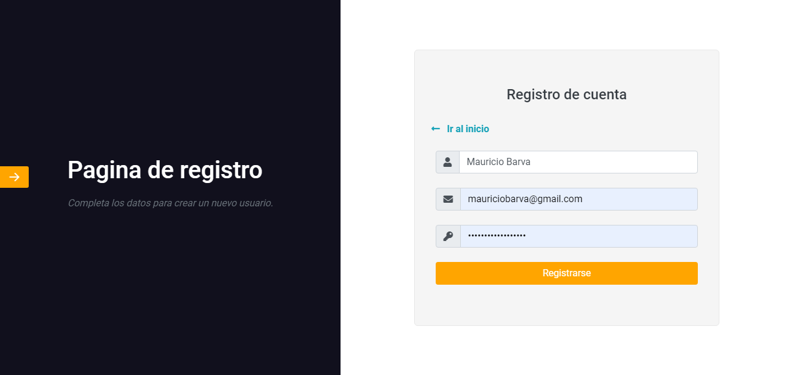

**Versión Móvil**

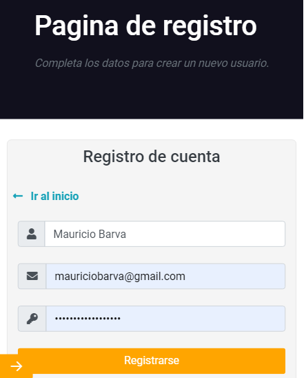


</center>

En ambas imágenes se observan 3 campos que piden la siguiente información para realizar un registro:

1. Nombre completo del usuario
2. Correo electrónico del usuario
3. Contraseña del usuario

También se encuentra un boton de menú en la barra lateral izquierda, para más información sobre este menú [click aqui](#menu-publico)

#### Código utilizado para crear un usuario

**Definición del servicio en el frontend para crear un nuevo usuario en el backend**

```Typescript
import { HttpClient } from '@angular/common/http';

@Injectable({
  providedIn: 'root'
})
export class AuthService {

    private _user!: ( AuthResponse | SocialUser );
    private baseUrl: string = 'https://dev36-auth.herokuapp.com';

     /**Getter del usuario*/
    get user() {
        return { ... this._user }
    }

    constructor(private httpClient: HttpClient) { }
    
    /**
     * Metodo para crear un usuario
     * @param name - Nombre del usuario
     * @param email - Correo del usuario
     * @param password - Contraseña del usuario
     * @returns - Si todo está bien usuario creado y token de acceso sino error
     */
    signup(name: string, email: string, password: string) {
    const url = `${this.baseUrl}/new`;
    const body = { name, email, password }

    return this.httpClient.post<AuthResponse>(url, body)
        .pipe(
        tap(resp => {
            this.setTokenAndUser(resp);
        }),
        catchError(err => of(err.error.msg))
        )
    }
    /**Metodo para colocar el token que devuelve jwt en el LocalStorage para validar el inicio de sesion*/
    setTokenAndUser(resp: AuthResponse) {
        localStorage.setItem('provider', 'ownLogin');
        localStorage.setItem('token', resp.token!);
        this._user = resp;
    }
}
```

**Implementación del servicio en el frontend para crear un nuevo usuario en el backend**

```Typescript
import { Component } from '@angular/core';
import { FormBuilder, FormGroup, Validators } from '@angular/forms';
import { Router } from '@angular/router';
//Modulo de alertas
import Swal from 'sweetalert2';
//Importación del servicio creado
import { AuthService } from '../../services/auth.service';

@Component({
  selector: 'app-formulario-registro',
  templateUrl: './formulario-registro.component.html'
})
export class FormularioRegistroComponent {
    //Se define el formulario para capturar los datos
    mySignup: FormGroup = this.fb.group({
        name: ['', [Validators.required, Validators.minLength(2)]],
        email: ['', [Validators.required, Validators.email]],
        password: ['', [Validators.required, Validators.minLength(6)]]
    });

    constructor(
        private fb: FormBuilder, 
        private router: Router,
        private authService: AuthService
        ) { }
    
    /**Metodo que se activa cuando el usuario crea un registro*/
    signup() {
        //Se recogen los valores del formulario
        const { name, email, password } = this.mySignup.value;

        // Se llama al servicio
        this.authService.signup(name, email, password)
        .subscribe(resp => {
            // Si la respuesta es exitosa redirige al Inicio de la aplicación
            if (resp.ok) {
                this.router.navigateByUrl('/dashboard');
            } else {
                // De lo contrario muestra un error
                Swal.fire(resp, 'Error', 'error');
            }
        })
    }
}
```

### Iniciar sesión

Esta es la página que carga por defecto cuando el usuario abre la [página de la aplicación](https://dev36-auth.herokuapp.com)

<center>

**Versión Web**

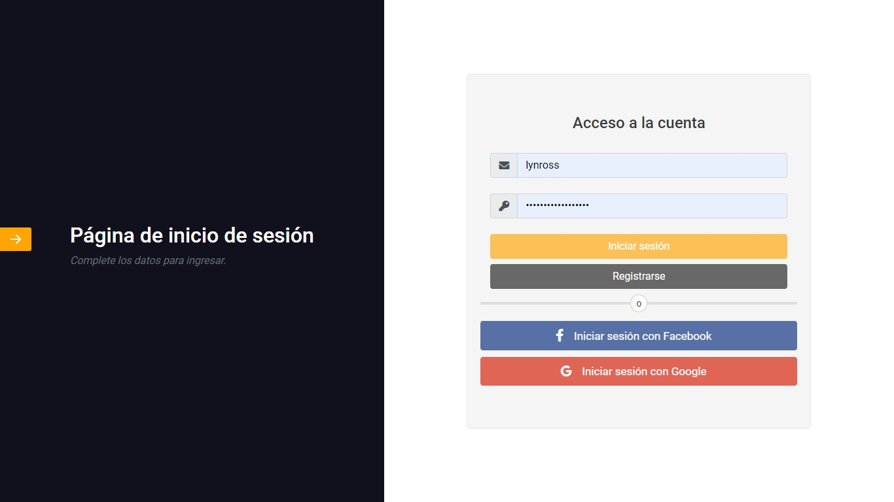

**Versión Móvil**

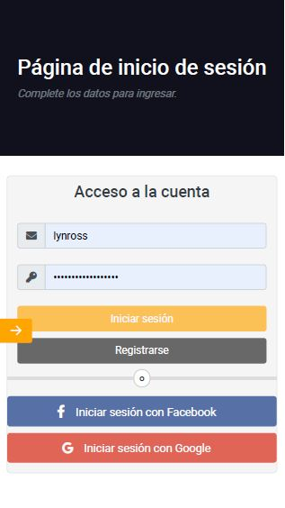

</center>

Se observa un formulario el cual solicita el **correo** y la **contraseña** con el fin de acceder a la [página de inicio de la Dashboard](#inicio) con un usuario creado por medio de la aplicación.
También está la posibilidad de iniciar sesión con [Facebook](#inicio-de-sesion-con-facebook) y [Google](#inicio-de-sesion-con-google)

#### Inicio de sesión por medio de la aplicación

**Definición del servicio  en el frontend para iniciar sesión por medio de la aplicación**

```Typescript
import { HttpClient } from '@angular/common/http';

@Injectable({
  providedIn: 'root'
})
export class AuthService {

    private _user!: ( AuthResponse | SocialUser );
    private baseUrl: string = 'https://dev36-auth.herokuapp.com';  

     /**Getter del usuario*/
    get user() {
        return { ... this._user }
    }

    constructor(private httpClient: HttpClient) { }
    /**
     * Metodo para iniciar sesión
    * @param email - Correo del usuario
    * @param password - Contraseña del usuario
    * @returns - Si todo está bien devuelve usuario y token de acceso sino error
    */
    login(email: string, password: string) {
    const url = `${this.baseUrl}/login`;
    const body = { email, password }

    return this.httpClient.post<AuthResponse>(url, body)
        .pipe(
        tap(resp => {
            if (resp.ok) {
                this.setTokenAndUser(resp);
            }
        }),
        catchError(err => of(err.error.msg))
        );
    }
    /**Metodo para colocar el token que devuelve jwt en el LocalStorage para validar el inicio de sesion*/
    setTokenAndUser(resp: AuthResponse) {
        localStorage.setItem('provider', 'ownLogin');
        localStorage.setItem('token', resp.token!);
        this._user = resp;
    }
}
```
**Implementación del servicio  en el frontend para iniciar sesión por medio de la aplicación**

```Typescript
import { Component } from '@angular/core';
import { FormBuilder, FormGroup, Validators } from '@angular/forms';
import { Router } from '@angular/router';
//Modulo de alertas
import Swal from 'sweetalert2'
//Importación del servicio
import { AuthService } from '../../services/auth.service';

@Component({
  selector: 'app-formulario-login',
  templateUrl: './formulario-login.component.html',
  styles: []
})
export class FormularioLoginComponent {
    //Se define el formulario para capturar los datos
    myLogin: FormGroup = this.formBuilder.group({
        email: ['', [Validators.required, Validators.email]],
        password: ['', [Validators.required, Validators.minLength(6)]]
    })

    constructor(
    private formBuilder: FormBuilder,
    private router: Router,
    private authService: AuthService
    ) { }

    /**Funcion ejecutada cuando el usuario trata de iniciar sesion*/
    login() {
        // Se caputan los datos del formulario
        const { email, password } = this.myLogin.value;
        //Se llama el servicio
        this.authService.login(email, password).subscribe(resp => {
            // Si los datos son correctos redirige a la pagina de inicio de la aplicación
            if (resp.ok === true) {
            this.router.navigateByUrl('/dashboard');
            } else {
            // Si son incorrectos mada un aviso de error
            Swal.fire('Error', resp, 'error');
            }
        });
    }
}

```

#### Inicio de sesión con redes sociales

Para iniciar sesión por medio de las redes sociales Facebook y Google primero se debe hacer la siguiente configuración en el archivo `app.module`

```Typescript
import { NgModule } from '@angular/core';
//Modulo de inicio de sesion con Facebook o Google
import { SocialLoginModule, SocialAuthServiceConfig } from 'angularx-social-login';
import { GoogleLoginProvider, FacebookLoginProvider } from 'angularx-social-login';

@NgModule({[
    imports[
        ...,
        SocialLoginModule
    ],
    providers: [
        ...,
        {
        provide: 'SocialAuthServiceConfig',
        useValue: {
        autoLogin: false,
        providers: [
            {
            id: GoogleLoginProvider.PROVIDER_ID,
            provider: new GoogleLoginProvider(
                'Identificador de la app de google'
            )
            },
            {
            id: FacebookLoginProvider.PROVIDER_ID,
            provider: new FacebookLoginProvider('Identificador de la app de Facebook')
            }
        ],
        onError: (err) => {
            console.error(err);
        }
        } as SocialAuthServiceConfig,
    }]
]})
export class AppModule { }
```
Una vez realizada la configuración en el paso anterior, se puede hacer uso de los métodos que trae
el modulo [angularx-social-login](https://www.npmjs.com/package/angularx-social-login)

#### Inicio de sesión con Facebook o Google

**Definición del servicio para iniciar sesión en Facebook o Google**

``` Typescript
import { Injectable } from '@angular/core';
import { AuthResponse, } from '../interfaces/auth.interface';
import { catchError, tap } from 'rxjs/operators';
import { of, pipe } from 'rxjs';

import { SocialAuthService } from "angularx-social-login";
import { SocialUser } from "angularx-social-login";

@Injectable({
  providedIn: 'root'
})
export class AuthService {

  private _user!: (AuthResponse | SocialUser );
  private isLogged: boolean = false;

   /**Getter del usuario*/
  get user() {
    return { ... this._user }
  }

  /**Getter del estado del usuario si inicia sesion con google y facebook*/
  get isLoggedIn() {
    return this.isLogged;
  }

  constructor(private authService: SocialAuthService) { }

  /**Metodo para saber si el usuario esta logeado en la app por medio de Facebook o Google*/
  loginGoogle() {
    return this.authService.authState.pipe(
      tap(user => {
        // Información del usuario de Facebook o Google
        this._user = user;
        // Si el usuario que recibe del servicio de angularx-social-login es distinto de null 
        // entonces la sesión está iniciada
        this.isLogged = (user != null);
        // Se revisa si el proveedor es Facebook o Google y coloca el token de inicio en el LocalStorage
        // Para futuras validaciones
        if ((user != null)) {
          if (user.provider == "GOOGLE") {
            localStorage.setItem('provider', 'GOOGLE');
            localStorage.setItem('token', user.idToken);
          }

          if (user.provider == "FACEBOOK") {
            localStorage.setItem('provider', 'FACEBOOK');
            localStorage.setItem('token', user.authToken);
          }
        }
      }), catchError(err => of(false, this.isLogged = false))
    )
  }

}

```

**Utilizacion del servicio para iniciar sesión en Facebook o Google**

```Typescript
import { Component, OnInit } from '@angular/core';
import { Router } from '@angular/router';
//Modulos de autenticacion con facebook y google
import { SocialAuthService } from "angularx-social-login";
import { FacebookLoginProvider, GoogleLoginProvider } from "angularx-social-login";

import { AuthService } from '../../services/auth.service';

@Component({
  selector: 'app-formulario-login',
  templateUrl: './formulario-login.component.html',
  styles: []
})
export class FormularioLoginComponent implements OnInit {

  constructor(
    private router: Router,
    private authService: AuthService,
    private googleFacebookAuth: SocialAuthService
    ) { }

  ngOnInit(): void {
    /**Funcion que se subscribe ( llama el servicio creado anteriormente ) y obtiene al usuario 
     * cuando este inicia sesion con facebook o google */
    this.authService.loginGoogle().subscribe(user => {
        //Si el usuario es null significa que no ha iniciado sesión
      if (user == null) {
        localStorage.clear();
        this.router.navigateByUrl('/auth');
      }
        // Si ya inicio sesión redirige a la pagina de inicio
      if ((user != null)) {
        this.router.navigateByUrl('/dashboard');
      }
    });
  }
  /**Funcion que abre la pantalla de iniciar sesion con google */
  signInWithGoogle(): void {
    this.googleFacebookAuth.signIn(GoogleLoginProvider.PROVIDER_ID);
  }
  /**Funcion que abre la pantalla de sesion con facebook*/
  signInWithFB(): void {
    this.googleFacebookAuth.signIn(FacebookLoginProvider.PROVIDER_ID);
  }
}

```


### Interfaces Involucradas

```Typescript
/**  Interfaz de la respuesta que devuelve la base de datos a iniciar/validar sesión del usuario*/

export interface AuthResponse {
    ok: boolean;
    token: string;
    user: User;
}

```

```Typescript
/** Interfaz de usuario */

export interface User {
    id: String,
    name: String;
    email: String;
    profile: Profile;
}

```

```Typescript
/**Interfaz del perfil del usuario */

export interface Profile {
    ZIP: Number;
    cc: Number;
    city: String;
    country: String;
    description: String;
    address: String;
    department: String;
    dateOfBirth: String;
}

```

```Typescript
/**Interfaz para los usuarios de Google o Facebook*/

export declare class SocialUser {
    provider: string;
    id: string;
    email: string;
    name: string;
    photoUrl: string;
    firstName: string;
    lastName: string;
    authToken: string;
    idToken: string;
    authorizationCode: string;
    response: any;
}

```

<center>

## Páginas privadas


</center>


Estas son las páginas con las que el usuario puede interacturar siempre y cuando haya iniciado sesión, de lo contrario no podrá acceder a estas.

### Inicio

Página de inicio donde se muestra una portada con el nombre del equipo, la foto de los integrantes y el logo de la UNAB en la parte inferior.

<center>

**Versión Web**

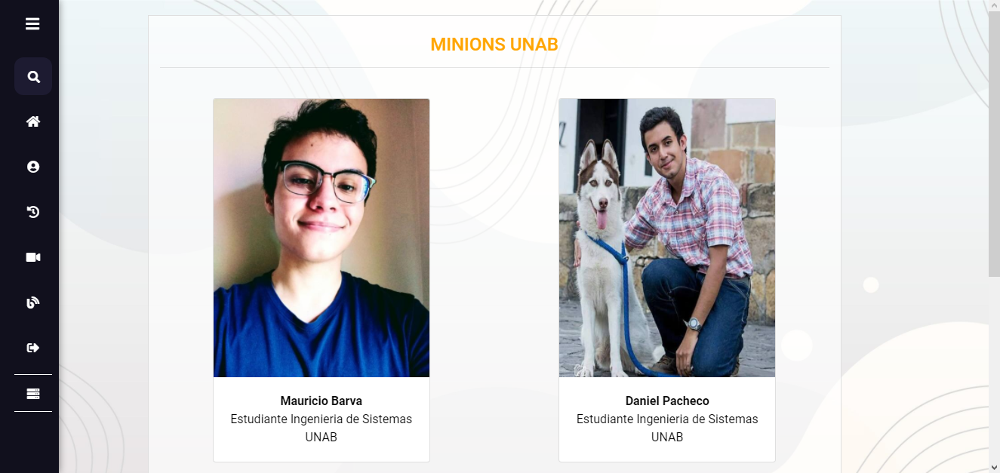

**Versión Móvil**


</center>

Código utilizado en la página de inicio

```Typescript
import { Component, OnInit } from '@angular/core';

import { AuthService } from '../../../iniciar-sesion/services/auth.service';

@Component({
  selector: 'app-home',
  templateUrl: './home.component.html',
  styleUrls: ['./home.component.css']
})
export class HomeComponent implements OnInit {

  /**Getter de la informacion de usuario qué está en el servicio definido en los pasos anteriores.
   * En el getter esta la información que se muestra en la parte del HTML.
  */
  get infoUser() {
    return this.authService.user.user;
  }

  constructor(private authService: AuthService) {
  }

  ngOnInit(): void {}
}

```

### Perfil

En esta página se encuentra un formulario por medio del cual se puede editar la información básica del usuario, para poder editar los campos se debe presionar un botón en la esquina superior derecha.

<center>

**Versión Web**

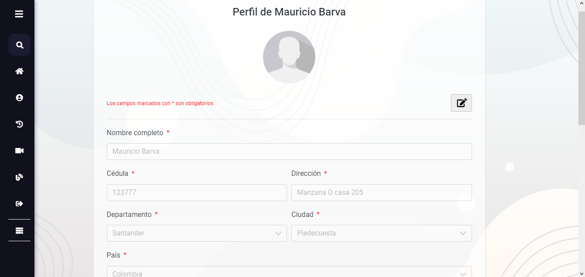

**Versión Móvil**

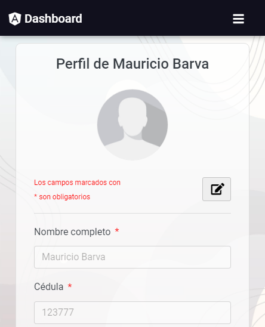

</center>

**Código utilizado en la página del perfil**

**Definición del servicio para subir una guardar el perfil del usuario en el backend**

```Typescript
import { HttpClient } from '@angular/common/http';
import { Injectable } from '@angular/core';
import { AuthResponse, User } from '../interfaces/auth.interface';
import { catchError, tap } from 'rxjs/operators';
import { of, pipe } from 'rxjs';

import { ProfileData } from 'src/app/usuarios/interfaces/user.interface';


@Injectable({
  providedIn: 'root'
})
export class AuthService {

  private baseUrl: string = 'https://dev36-auth.herokuapp.com';
  private _user!: (AuthResponse | SocialUser | any );

  /**Getter del usuario*/
  get user() {
    return { ... this._user }
  }

  constructor(private httpClient: HttpClient) { }

  /**Metodo para llenar el formulario de perfil de usuario */
  userProfile(user: ProfileData, id: string, provider: string = '') {
    const url = `${this.baseUrl}/update/${id}/${provider}`;
    const body = {
      name: user.name,
      cc: user.cc,
      address: user.address,
      dateOfBirth: user.dateOfBirth,
      city: user.city,
      department: user.department,
      country: user.country,
      ZIP: user.ZIP,
      profession: user.profession,
      skills: user.skills,
      description: user.description
    }

    return this.httpClient.put<AuthResponse>(url, body).pipe(
      tap(user => this._user = user),
      catchError(err => of(err.error))
    )
  }

  /**
   * Metodo que sube la imagen del usuario
   * @param files - Datos de la imagen
   */
  uploadImage(id: string, files, provider: string = '') {
    const url = `${this.baseUrl}/upload-image/${id}/${provider}`;
    const formData = new FormData();
    formData.append('image', files)

    return this.httpClient.post<any>(url, formData).pipe(
      tap(user => this._user = user),
      catchError(err => of(err.error))
    )
  }
 
}


```

&nbsp;
**Definición de los servicio de la API REST de los departamentos y municipios de colombia**
&nbsp;

```Typescript
import { HttpParams, HttpClient, HttpHeaders } from '@angular/common/http';
import { Injectable } from '@angular/core';
import { Observable } from 'rxjs';
import { WebServiceResponse } from '../pages/web-service/interfaces/web-service.interface';

@Injectable({
  providedIn: 'root'
})
export class UsuarioService {

  private baseURL: string = 'https://www.datos.gov.co/resource/xdk5-pm3f.json';

  constructor(private http: HttpClient) { }
  
  /**Getter de los headers */
  get getHeaders() {
    return new HttpHeaders().set('X-App-Token', 'TOKEN_APP');
  }
  /**
   * 
   * @param {string} department - Nombre departamento
   * @returns Informacion del departamento
   */
  byDepartment(department: string): Observable<WebServiceResponse[]> {
    const url = `${this.baseURL}?`
    const params = new HttpParams().set('departamento', department);

    return this.http.get<WebServiceResponse[]>(url, { headers: this.getHeaders, params });
  }
}

```
Para este proyecto se utilizaron los departamentos, más adelante, en la implementación se obtienen los municipios de este cuando el usuario selecciona un departamento.
El **TOKEN_APP** puede ser obtenido creando una aplicación en el link que se provee a continuación.
**Para más información sobre el uso que ofrece esta API REST puedes consultar aquí: [API REST de los departamentos y municipios de Colombia](https://www.datos.gov.co/en/Mapas-Nacionales/Departamentos-y-municipios-de-Colombia/xdk5-pm3f)**


&nbsp;
**Función adicional utilizada donde son almacenados los departamentos**
&nbsp;

```Typescript
 /**Metodo que devuelve los departamentos de colombia
   * @returns Departamentos de colombia
   */
export default function getDepartments() {
    return [
      { label: "Amazonas", value: "Amazonas" },
      { label: "Antioquía", value: "Antioquia" },
      { label: "Arauca", value: "Arauca" },
      { label: "Atlántico", value: "Atlántico" },
      { label: "Bolívar", value: "Bolívar" },
      { label: "Boyacá", value: "Boyacá" },
      { label: "Caldas", value: "Caldas" },
      { label: "Caquetá", value: "Caquetá" },
      { label: "Casanare", value: "Casanare" },
      { label: "Cauca", value: "Cauca" },
      { label: "Cesar", value: "Cesar" },
      { label: "Chocó", value: "Chocó" },
      { label: "Córdoba", value: "Córdoba" },
      { label: "Cundinamarca", value: "Cundinamarca" },
      { label: "Guainía", value: "Guainía" },
      { label: "Guaviare", value: "Guaviare" },
      { label: "Huila", value: "Huila" },
      { label: "La Guajira", value: "La Guajira" },
      { label: "Magdalena", value: "Magdalena" },
      { label: "Meta", value: "Meta" },
      { label: "Nariño", value: "Nariño" },
      { label: "Norte de Santander", value: "Norte de Santander" },
      { label: "Putumayo", value: "Putumayo" },
      { label: "Quindío", value: "Quindío" },
      { label: "Risaralda", value: "Risaralda" },
      { label: "Santander", value: "Santander" },
      { label: "Sucre", value: "Sucre" },
      { label: "Tolima", value: "Tolima" },
      { label: "Valle del Cauca", value: "Valle del Cauca" },
      { label: "Vaupés", value: "Vaupés" },
      { label: "Vichada", value: "Vichada" }
    ]
  }
```
Se obtuvieron los nombres de los departamentos  de esta forma y no utilizando la API REST con el objetivo de simplificar.

&nbsp;
**Implementación del servicio para subir guardar el perfil del usuario en el backend**
&nbsp;

```Typescript
import { AfterViewInit, Component, OnInit } from '@angular/core';
import Swal from 'sweetalert2'
import { switchMap } from 'rxjs/operators';

import { AuthService } from '../../../iniciar-sesion/services/auth.service';
import { ProfileData } from '../../interfaces/user.interface';
import getDepartments from '../../functions/departments';
import { UsuarioService } from '../../services/usuario.service';

@Component({
  selector: 'app-profile',
  templateUrl: './profile.component.html',
  styles: []
})
export class ProfileComponent implements OnInit, AfterViewInit {

  dbUser = this.authService.user.user;
  editProfile: ProfileData | any;
  disabledItem: boolean = true;
  disableAll: boolean = false;
  file: File;
  photoSelected: string | ArrayBuffer;
  flag: number = 0;
  departments: object[] = [];
  municipalities: object[] = [];
  countries: object[] = [];
  skills: string[] = [
    "Creatividad",
    "Persuasión",
    "Colaboración",
    "Adaptabilidad",
    "Paciencia",
    "Comunicación",
    "Velocidad",
    "Fortaleza",
    "Proactividad",
    "Sociabilidad"
  ]

  constructor(
    private authService: AuthService,
    private userService: UsuarioService
  ) {
    //Desestructuracion de la informacion del usuario traida de la base de datos 
    let {
      cc,
      address,
      dateOfBirth,
      city,
      department,
      country,
      ZIP,
      profession,
      description,
      skills,
      image
    } = this.dbUser.profile;
    //Asignacion de los valores desestructurados al usuario que se enviara a la base de datos
    this.editProfile = {
      name: this.dbUser.name,
      cc,
      address,
      dateOfBirth,
      city,
      department,
      country,
      ZIP,
      profession,
      skills,
      description,
      image
    }
  }

  ngOnInit(): void {
    this.departments = getDepartments();
    this.selectedDepartment();
    this.countries = [{ country: 'Colombia' }];
  }
  /**Funciones que se activan al iniciar el contenido de las vistas */
  ngAfterViewInit(): void {
    //Contar skills que ya tiene el usuario guardados
    this.contarChecks.putActiveFromBd(this.dbUser.profile.skills);
    this.contarChecks.flagGuardian();
    //Cargar imagen
    this.authService.getImageFile(this.dbUser.profile.image).subscribe(
      image => {
        const reader = new FileReader();
        reader.onload = e => this.photoSelected = reader.result
        reader.readAsDataURL(image);
      }
    )
  }
  /**Funcion que trae los municipios cuando se selecciona un departamento */
  selectedDepartment() {
    this.userService.byDepartment(this.editProfile.department)
      .subscribe(departments => {
        this.municipalities = [];
        departments.forEach(({ municipio }) => {
          this.municipalities.push({ municipio });
        });
      });
  }
  /** FUncion que me permite actualizar el perfil del usuario*/
  sendProfile(formulario) {
    if (this.file != undefined) {
      this.authService.uploadImage(this.dbUser.id, this.file, localStorage.getItem('provider') || '')
        .pipe(
          switchMap(data => {
            return this.authService.userProfile(this.editProfile, this.dbUser.id, localStorage.getItem('provider') || '')
          })
        ).subscribe(data => {
          if (data.ok == false) {
            Swal.fire('Error', data.msg, 'error');
          } else {
            Swal.fire('Todo en orden :)', data.msg, 'success');
          }
        });
    } else {
      this.authService.userProfile(this.editProfile, this.dbUser.id, localStorage.getItem('provider') || '')
        .subscribe(data => {
          if (data.ok == false) {
            Swal.fire('Error', data.msg, 'error');
          } else {
            Swal.fire('Todo en orden :)', data.msg, 'success');
          }
        });

    }
  }
  /**
   * Funcion que recibe la foto que el usuario sube y da un preview
   * @param foto - Informacion de la foto subida por el usuario
   */
  onPhotoSelected(foto) {
    if (foto.target.files && foto.target.files[0]) {
      const { size, type } = foto.target.files[0]
      const imageType = type.split('/')[1];

      if (size > 1000000 || imageType != 'jpg' && imageType != 'png') {
        Swal.fire('Unable to upload your image', 'The image must be in jpg or png format and size less than 1 MB.', 'warning');
        return false;
      }
      //Previsualizacion de la imagen
      this.file = foto.target.files[0];
      const reader = new FileReader();
      reader.onload = e => this.photoSelected = reader.result;
      reader.readAsDataURL(this.file);
    }
  }
  /**Funcion para que los campos del perfil  sean editables */
  editFields(btnEdit) {
    btnEdit.classList.toggle('btn-profile-active');
    //Funcion que me toma el div que cubre los skills y le togglea una clase para que sean editables o no
    document.querySelectorAll('.cover-select-class').forEach(element => {
      element.classList.toggle('cover');
    });
    this.disabledItem = !this.disabledItem;
    return false;
  }
  /**Funcion que toma la fecha del componente de primeng y se la establece al usuario a editar */
  onChangeDate(fecha) {
    this.editProfile.dateOfBirth = fecha;
  }
  /**Objeto literal que me permite controlar los checkbox
   * @property { function } url - Funcion retorna un array con los checkbox
   * @property { function } true - Funcion suma una habilidad al array de habilidades de usuario
   * @property { function } false - Funcion resta una habilidad al array de habilidades de usuario
   * @property { function } active - Funcion que remueve el atributo disabled a los checkbox
   * @property { function } disable - Funcion que añade el atributo disabled a los checkbox
   * @property { function } putActiveFromBd - Funcion que pone el atributo checkeck del checkbox en true si ya lo tenia el usuario
   * @property { function } flagGuardian - Funcion se fija si ya tiene 3 habilidades seleccionadas al cargar la info del usuario
   * @property { function } null - Funcion de error en caso de que se envie un valor que no valido
   */
  contarChecks = {
    url: () => {
      let checkbox = document.querySelectorAll('.form-check-input');
      return checkbox;
    },
    true: (value: string) => {
      this.flag += 1;
      if (!this.editProfile.skills.includes(value)) {
        this.editProfile.skills.push(value)
      };
    },
    false: (checkbox) => {
      this.flag -= 1;
      this.editProfile.skills.splice(this.editProfile.skills.indexOf(checkbox), 1);
    },
    "active": () => {
      this.contarChecks.url().forEach((element: any) => {
        if (!element.checked) {
          element.removeAttribute('disabled');
        };
      });
    },
    "disable": () => {
      this.contarChecks.url().forEach((element: any) => {
        if (!element.checked) {
          element.setAttribute('disabled', 'true');
        };
      });
    },
    putActiveFromBd: (arr) => {
      this.contarChecks.url().forEach((element: any) => {
        if (arr.includes(element.value)) {
          element.checked = true;
          this.contarChecks.true(element.value);
        }
      });
    },
    flagGuardian: () => {
      if (this.flag > 2) {
        return this.contarChecks.disable();
      }
    },
    null: () => this.flag = this.flag
  }
  /**Funcion que se ejecuta cada vez que se selecciona un checkbox */
  seleccionado(checkbox) {
    this.contarChecks[checkbox.target.checked](checkbox.target.value);
    return (this.flag < 3) ? this.contarChecks['active']() : this.contarChecks['disable']()
  }
}
```


### Registros

Esta es la página donde se muestra la información que el usuario añadio en el Perfil

<center>

**Versión Web**

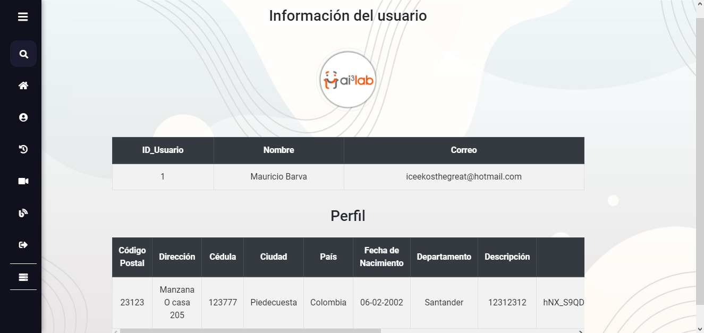

**Versión Móvil**

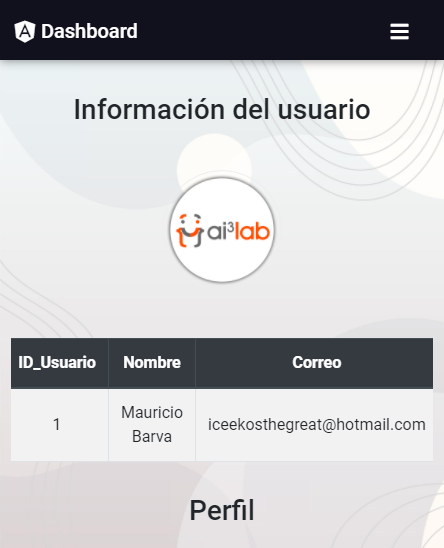

</center>

**Código utilizado en la página de registros**

Definición del servicio para traer la imágen del usuario del backend

```Typescript
import { HttpClient } from '@angular/common/http';
import { Injectable } from '@angular/core';
import { catchError, tap } from 'rxjs/operators';
import { of, pipe } from 'rxjs';

@Injectable({
  providedIn: 'root'
})
export class AuthService {

  private baseUrl: string = 'https://dev36-auth.herokuapp.com';

  constructor(private httpClient: HttpClient) { }
  
  /**
   * Metodo que busca en el backend la imagen del usuario para mostrarla
   * @param fileName - Nombre de la imagen que tiene el usuario
   * @returns - Imagen del usuario
   */
  getImageFile(fileName: string) {
    const url = `${this.baseUrl}/get-image/${fileName}`;

    return this.httpClient.get<any>(url, { responseType: 'Blob' as 'json' }).pipe(
      catchError(err => of(err.error))
    );
  }
}

```

Implementación del servicio para traer la imágen del usuario del backend

```Typescript
import { Component, OnInit } from '@angular/core';

import { AuthService } from '../../../iniciar-sesion/services/auth.service';

@Component({
  selector: 'app-history',
  templateUrl: './history.component.html',
  styles: []
})
export class HistoryComponent implements OnInit {

  // Variable en la que se guarda la imagen que es mostrada en el HTML
  photoSelected: string | ArrayBuffer;

  /**Metodo que devuelve la información del usuario que es mostrada en el HTML */
  get userInfo() {
    return this.authService.user;
  }
  
  constructor(private authService: AuthService) { }

  ngOnInit(): void {
    this.authService.getImageFile(this.userInfo.user.profile.image).subscribe(
      image => {
        const reader = new FileReader();
        reader.onload = e => this.photoSelected = reader.result;
        reader.readAsDataURL(image);
      }
    );
  }

}

```

### Video

En esta página se encuentra un video incrustado

<center>

**Versión Web**

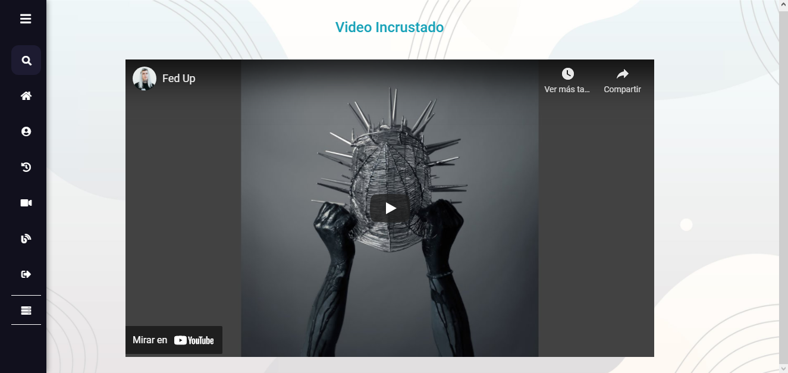

**Versión Móvil**


</center>

El video fue añadido con el objetivo de cumplir una actividad sin más.

<center>

### **Blog**
&nbsp;


</center>
&nbsp;
&nbsp;

En esta parte se hace uso de la [API REST de WordPress](https://developer.wordpress.org/rest-api/) con el objetivo de
**ver todas las entradas, ver una en específico, crearlas, editarlas. Crear categorías y administrar estas mismas a través de Angular.** 

**Para ver la página de WordPress que se utiliza para conectarla con Angular puedes hacer [click aquí](https://dev36.latiendasigueabierta.com)**

#### Todas las entradas

<center>

**Versión Web**


**Versión Móvil**


</center>


**Definición del servicio para obtener las entradas de WordPress**

```Typescript
import { HttpClient } from '@angular/common/http';
import { Injectable } from '@angular/core';
import { Observable } from 'rxjs'

import { Post } from '../../interfaces/post.interface';

@Injectable({
  providedIn: 'root'
})
export class WordpressService {

  private urlWP: string = 'https://dev36.latiendasigueabierta.com/wp-json/wp/v2';

  constructor(private http: HttpClient) { }
 
  /**
   * Funcion buscar las entradas en la página de WordPress
   * @param id - numero de entradas a mostrar
   * @returns - Todas las entradas con el numero indicado ( si existen )
   */
  getAll(id: number): Observable<Post[]> {
    const url = `${this.urlWP}/posts`
    return this.http.get<Post[]>(`${url}?_embed&per_page=${id}`);
  }

}

```

**Implementación del servicio para obtener las entradas de WordPress**

```Typescript
import { Component, OnInit } from '@angular/core';

import { Post } from '../../interfaces/post.interface';
import { WordpressService } from '../../services/wordpress.service';

@Component({
  selector: 'app-blog',
  templateUrl: './blog.component.html',
  styleUrls: ['./blog.component.css']
})
export class BlogComponent implements OnInit {

  posts!: Post[];
  filterPosts!: Post[];

  constructor(private wpService: WordpressService) { }

  ngOnInit(): void {
    // Se llama el servicio creado anteriormente y se guardan las entradas para mostrarlas en el HTML
    this.wpService.getAll(50).subscribe(posts => {
      this.posts = posts;
      this.filterPosts = posts;
    },
      (error) => {
        console.log(error);
      });
  }
   /**Filtro de las entradas
   * Funcion que busca entradas que tengan contenido relacionado al parametro query
   * @param query - Termino de busqueda
   */
  searchPost(query: string) {
    query = query.toLowerCase().trim();
    // Se filtran los posts con las coincidencias
    this.posts = this.filterPosts.filter(post => {
      return post.title.rendered.toLowerCase().includes(query) ||
        post['_embedded']['author']['0'].name.toLowerCase().includes(query) ||
        post.excerpt.rendered.toLowerCase().includes(query)
    });
  }
}

```


#### Ver entrada específica

En esta página se ve más información de una entrada a la que el usuario haya accedido

<center>

**Versión Web**


**Versión Móvil**


</center>

**Definición del servicio para obtener la información de una entrada específica**

```Typescript
import { HttpClient } from '@angular/common/http';
import { Injectable } from '@angular/core';
import { Observable } from 'rxjs'

import { Post } from '../../interfaces/post.interface';

@Injectable({
  providedIn: 'root'
})
export class WordpressService {

  private urlWP: string = 'https://dev36.latiendasigueabierta.com/wp-json/wp/v2';

  constructor(private http: HttpClient) { }

 /**
   * Funcion para buscar un entrada por su slug
   * @param id - slug del entrada
   * @returns - Información de la entrada
   */
  getSinglePost(id: string): Observable<Post> {
    const url = `${this.urlWP}/posts`
    return this.http.get<Post>(`${url}?_embed&slug=${id}`);
  }

}
```

**Implementación del servicio para obtener la información de una entrada específica**

```Typescript
import { Component, OnInit } from '@angular/core';
import { ActivatedRoute } from '@angular/router';
import { switchMap } from 'rxjs/operators';

import { WordpressService } from '../../services/wordpress.service';
import { WordpressUser } from '../../interfaces/logged-wp-user.interface';
import { Post } from '../../interfaces/post.interface';

@Component({
  selector: 'app-single-post',
  templateUrl: './single-post.component.html',
  styleUrls: ['./single-post.component.css']
})
export class SinglePostComponent implements OnInit {

  slug: string;
  post: Post;

  constructor(private wpService: WordpressService, private route: ActivatedRoute) { }

  ngOnInit(): void {
    //Toma el slug de la url y busca el post en la api de wp
    this.route.params.pipe(
      switchMap(({ slug }) => {
        this.slug = slug
        return this.wpService.getSinglePost(slug)
      })
    ).subscribe(post => this.post = post, (error) => console.log(error));
  }
}

```

#### Iniciar sesión en WordPress

En esta página se observa un formulario para iniciar sesión en WordPress.
**Si el usuario quiere utilizar las funcionalidades de añadir, editar entradas, etc, debe iniciar sesión y su cuenta debe tener el rol de Administrador**

<center>

**Versión Web**

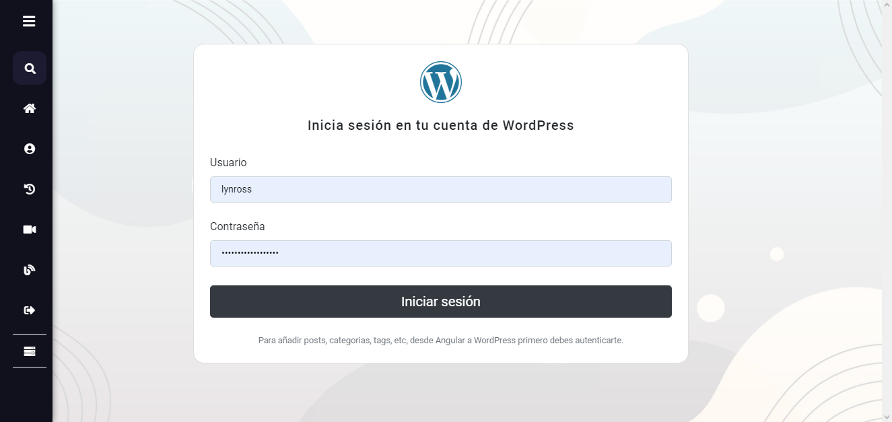

**Versión Móvil**

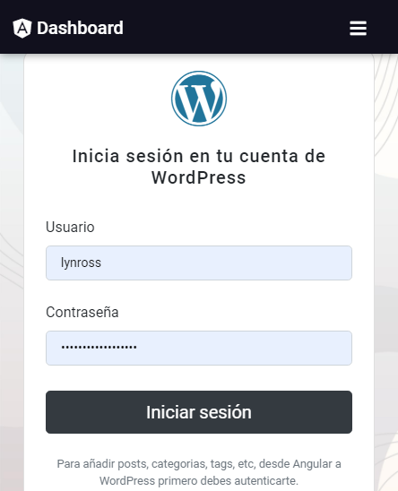

</center>

**Definición del servicio para iniciar sesión en WordPress**

```Typescript
import { HttpClient } from '@angular/common/http';
import { Injectable } from '@angular/core';

import { UserWordpress } from '../interfaces/user-wp.interface';

@Injectable({
  providedIn: 'root'
})
export class WordpressService {

  private urlWpToken: string = 'https://dev36.latiendasigueabierta.com/wp-json/jwt-auth/v1/token';

  constructor(private http: HttpClient) { }

 /**
   * Funcion para iniciar sesion en wordpress
   * @param username - nombre de usuario
   * @param password - contraseña
   * @returns - Informacion del basica del usuario y token
   */
  wordpressLogin(username: string, password: string) {
    const body = { username, password }

    return this.http.post<UserWordpress>(this.urlWpToken, body)
      .pipe(
        tap(data => {
          if (data.token) {
            localStorage.setItem('wp-token', data.token);
          }
        }),
        catchError(error => of(error))
      );
  }

}

```
Se pone le token que devuelve la petición en el localStorage con el fin de validar la sesión del usuario cada vez que quiera añadir o borrar algun elemento de WordPress.

**Implementación del servicio para iniciar sesión en WordPress**

```Typescript
import { Component, OnInit } from '@angular/core';
import Swal from 'sweetalert2';
import { FormBuilder, FormGroup, Validators } from '@angular/forms';
import { Router } from '@angular/router';

import { WordpressService } from '../../services/wordpress.service';

@Component({
  selector: 'login-wp',
  templateUrl: './login-wp.component.html',
  styleUrls: ['./login-wp.component.css']
})
export class LoginWpComponent implements OnInit {
  // Se define el formulario para obtener el usuario y la contraseña
  myLogin: FormGroup = this.formBuilder.group({
    username: ['', [Validators.required]],
    password: ['', [Validators.required]]
  });
  // Banderas para saber si el usuario ya tiene la sesión iniciada
  isWpLogged: boolean = false;
  loading: boolean = false;

  constructor(
    private wpService: WordpressService, 
    private formBuilder: FormBuilder, 
    private router: Router
    ) { }

  ngOnInit(): void {
    //Si ya inicio sesion que redirige a la pagina de inicio del blog 
    if (localStorage.getItem('wp-token')) {
      this.isWpLogged = true;
      this.router.navigateByUrl('dashboard/blog');
      return;
    }
    this.isWpLogged = false;
  }

  /**
   * Funcion para iniciar sesión en wordpress, es ejecutada cuando el usuario le da click al botón Iniciar Sesión
   */
  iniciarSesionWp() {
    this.isWpLogged = true;
    // Se capturan los valores del formulario
    const { username, password } = this.myLogin.value;
    // Se llama el servicio creado anteriormente
    this.wpService.wordpressLogin(username, password).subscribe(data => {
      if (data.error) {
        Swal.fire('Oops', 'Parece que el usuario o contraseña son incorrectos, por favor cambialos e  intenta de nuevo.', 'error');
        this.isWpLogged = false;
        return false;
      }
      this.router.navigateByUrl('dashboard/blog');
    });
  }

}
```

#### Crear entrada

Esta página permite añadir nuevas entradas a la página de WordPress desde Angular. **El usuario debe iniciar sesión primero y tener el rol de Administrador, de lo contrario no podrá realizar esta acción.**

<center>

**Versión Web**

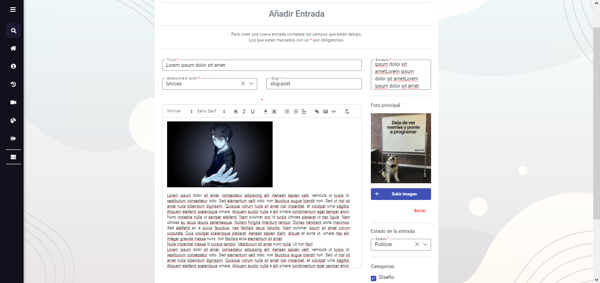

**Versión Móvil**

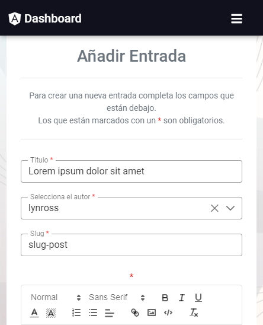

</center>

**Definición de los servicios para crear una entrada en WordPress**

```Typescript
import { HttpClient } from '@angular/common/http';
import { Injectable } from '@angular/core';

import { NewPost } from '../interfaces/new-post-wp.interface';

@Injectable({
  providedIn: 'root'
})
export class WordpressService {

  private urlWp: string = 'https://dev36.latiendasigueabierta.com/wp-json/wp/v2';
    /**Getter de los headers */
  get wpHeaders() {
    //Se envia el token que está en el localStorage por los headers
    // Si es válido permite añadir el post de lo contrario da error
    return new HttpHeaders().set('Authorization', 'Bearer ' + localStorage.getItem('wp-token') || '');
  }

  constructor(private http: HttpClient) { }

  /**
   * Funcion para crear un nuevo post en wordpress
   * @param body - Datos basicos para crear un post
   * @returns - Informacion del post creado
   */
  newPost(body: NewPost): Observable<NewPost> {
    const url = `${this.urlWP}/posts`;

    return this.http.post<NewPost>(url, body, { headers: this.wpHeaders }).pipe(
      catchError(err => of(err))
    )
  }
    /**
   * Funcion que toma la informacion del usuario que inicio sesion
   * @returns Usuario de wordpress que inicio sesion
   */
  getWPUser(): Observable<WordpressUser> {
    const url = `${this.urlWP}/users/me`;

    return this.http.post<WordpressUser>(url, null, { headers: this.wpHeaders })
      .pipe(
        catchError(err => of(err))
      );
  }
  /**
   * Funcion para añadir media a wordpress
   * @param slug - Slug de la imagen
   * @param title - Titulo de la imagen
   * @param author - Id de la persona que subio la imagen
   * @param file - Imagen
   * @returns - Informacion de la imagen
   */
  uploadMedia(slug: string, title: string, author: any, file: any) {
    const url = `${this.urlWP}/media`;
    const formData = new FormData();

    formData.append('slug', slug);
    formData.append('status', 'publish');
    formData.append('title', title);
    formData.append('author', author);
    formData.append('media_type', 'image');
    formData.append('file', file);
    formData.append('comment_status', 'closed');

    return this.http.post(url, formData, { headers: this.wpHeaders })
      .pipe(
        catchError(err => of(err))
      )
  }
   /**
   * Funcion para obtener las categorias que estan en wordpress
   * @returns Categorias almacenadas en wordpress 
   */
  getCategories(): Observable<WpCategory[]> {
    const params = new HttpParams().set('per_page', 100);
    const url = `${this.urlWP}/categories?`;

    return this.http.get<WpCategory[]>(url, { params })
      .pipe(
        catchError(err => of(err))
      );
  }

   /**
   * Funcion que devuelve los usuarios de wordpress
   * @returns - Nombre e id de los usuarios
   */
  getAllUsers(): Observable<WordpressUser[]> {
    const url = `${this.urlWP}/users`;

    return this.http.get<WordpressUser[]>(url, { headers: this.wpHeaders })
      .pipe(
        map(users => {
          let filteredUsers = [];

          users.forEach(({ name, id }) => filteredUsers.push({ name, id }));
          return filteredUsers;
        }),
        catchError(error => of(error))
      );
  }
   /**
   * Funcion para cerrar sesion en wordpress
   */
  wpLogout() {
    if (localStorage.getItem('wp-token')) {
      localStorage.removeItem('wp-token');
    }
  }

}
```

**Implementación del servicio para crear una entrada en WordPress**

```Typescript
import { Component, OnInit } from '@angular/core';
import { switchMap } from 'rxjs/operators';
import { FormGroup, FormBuilder, Validators } from '@angular/forms';
import Swal from 'sweetalert2';

import { WordpressService } from '../../services/wordpress.service';
import { WordpressUser } from '../../interfaces/logged-wp-user.interface';
import { WpCategory } from '../../interfaces/wp-category.interface';

@Component({
  selector: 'new-post',
  templateUrl: './new-post.component.html',
  styleUrls: ['./new-post.component.css']
})
export class NewPostComponent implements OnInit {

  formPost: FormGroup = this.formBuilder.group({
    title: ['', [Validators.required]],
    author: ['', [Validators.required]],
    slug: ['', [Validators.required]],
    content: ['', [Validators.required]],
    excerpt: ['', [Validators.required]],
    status: ['', [Validators.required]],
    categories: ['', [Validators.required]],
    featured_media: [undefined]
  });
  photoSelected: string | ArrayBuffer;
  wpUser!: WordpressUser;
  isWPLogged: boolean;
  authors: object[];
  status: object[];
  file: File;
  categories: WpCategory[] = [];
  loading = false;

  constructor(private formBuilder: FormBuilder, private wpService: WordpressService) { }

  ngOnInit(): void {
    //Valida si el usuario inicio sesion  y el rol que tiene
    this.wpService.getWPUser().subscribe(user => {
      if (user["error"]) {
        this.isWPLogged = false;
        this.wpService.wpLogout();
      } else {
        this.wpUser = user;
        this.isWPLogged = true;
      }
    });
    // LLama la función de las categorias almacenadas en WordPress
    this.wpService.getCategories().subscribe(categories => {
      categories.forEach(({ name, id }) => {
        this.categories.push({ name, id });
      })
    });
    // LLama la función de los autores creados en WordPress
    this.wpService.getAllUsers().subscribe(users => this.authors = users);
    // Definición de los estados de la entrada
    this.status = [
      {
        status: 'Publicar',
        value: 'publish'
      }
    ]
  }
  /**Funcion para crear un nuevo post */
  newPost() {
    this.loading = true;
    if (this.file != undefined) {
      const title = this.file.name.split('.')[0];
      const slug = this.file.name.split('.')[0];
      const author = this.wpUser.id;

      this.wpService.uploadMedia(slug, title, author, this.file)
        .pipe(
          switchMap(image => {
            if (image["error"]) {
              Swal.fire('Oops!', image["error"], 'error');
              return;
            } else {
              this.formPost.get('featured_media').setValue(parseInt(image.id));
              return this.wpService.newPost(this.formPost.value);
            }
          })
        ).subscribe(post => {
          this.newPostHandleError(post);
        })
    } else {
      this.wpService.newPost(this.formPost.value).subscribe(post => {
        this.newPostHandleError(post);
      });
    }
  }

  /**
   * Funcion que recibe un post analiza si hay errores o fue exitoso
   * @param post - Post
   */
  newPostHandleError(post: any) {
    if (post["error"]) {
      Swal.fire('Oops!', post["error"], 'error');
      return;
    } else {
      this.postStored();
      this.deleteImage();
    }
  }

  /**Funcion muestra un mensaje cuando el post se guarda con exito */
  postStored() {
    this.loading = false;
    Swal.fire('Todo en orden!', 'El post ha sido añadido correctamente!', 'success');
    this.formPost.reset();
  }

  /**Funcion que muestra una preview de la imagen principal del post */
  onPhotoSelected(e) {
    if (e.target.files && e.target.files[0] && e.target.files[0].type.includes("image")) {
      this.file = e.target.files[0];
      const reader = new FileReader();
      reader.onload = e => this.photoSelected = reader.result;
      reader.readAsDataURL(this.file);
    } else {
      Swal.fire('Error', 'Solo puedes subir imagenes.', 'error');
    }
  }
  /**Funcion para borrar la imagen */
  deleteImage() {
    this.file = undefined;
    this.photoSelected = undefined;
  }
}

```


#### Editar entrada

En esta página se puede editar una entrada que esté publicada en la página de WordPress.**El usuario debe iniciar sesión primero y tener el rol de Administrador, de lo contrario no podrá realizar esta acción.**

<center>

**Versión Web**

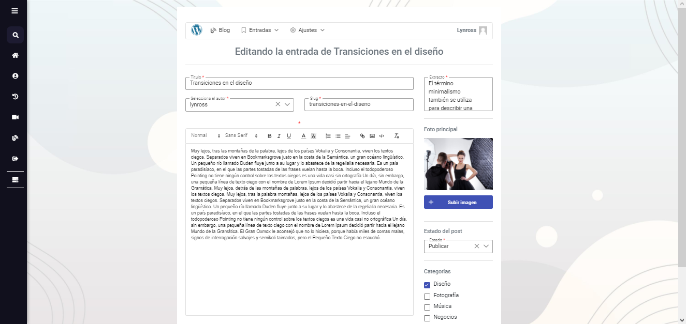

**Versión Móvil**

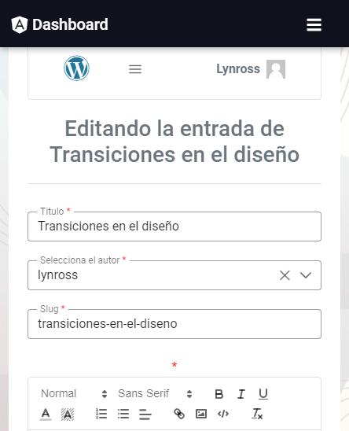

</center>

**Definición de los servicios utilizados para editar una entrada desde Angular a WordPress**

```Typescript
import { HttpClient, HttpHeaders, HttpParams } from '@angular/common/http';
import { Injectable } from '@angular/core';
import { catchError, map, tap } from 'rxjs/operators';
import { of, Observable } from 'rxjs'
import { environment } from 'src/environments/environment';

import { WordpressUser } from '../interfaces/logged-wp-user.interface';
import { NewPost } from '../interfaces/new-post-wp.interface';
import { Post } from '../interfaces/post.interface';
import { UserWordpress } from '../interfaces/user-wp.interface';
import { WpCategory } from '../interfaces/wp-category.interface';
import { ValidateWPToken } from '../interfaces/wp-token.interface';
import { NewCategory } from '../interfaces/new-category.interface';

@Injectable({
  providedIn: 'root'
})
export class WordpressService {

  private urlWP: string = environment.wpURL;

  constructor(private http: HttpClient) { }
  /**Getter de los headers */
  get wpHeaders() {
    return new HttpHeaders().set('Authorization', 'Bearer ' + localStorage.getItem('wp-token') || '');
  }
  /**
   * Funcion para buscar un post por su slug
   * @param id - slug del post
   */
  getSinglePost(id: string): Observable<Post> {
    const url = `${this.urlWP}/posts`
    return this.http.get<Post>(`${url}?_embed&slug=${id}`);
  }
  /**
   * Funcion que toma la informacion del usuario que inicio sesion
   * @returns Usuario de wordpress que inicio sesion
   */
  getWPUser(): Observable<WordpressUser> {
    const url = `${this.urlWP}/users/me`;

    return this.http.post<WordpressUser>(url, null, { headers: this.wpHeaders })
      .pipe(
        catchError(err => of(err))
      );
  }
  /**
   * Funcion para añadir media a wordpress
   * @param slug - Slug de la imagen
   * @param title - Titulo de la imagen
   * @param author - Id de la persona que subio la imagen
   * @param file - Imagen
   * @returns - Informacion de la imagen
   */
  uploadMedia(slug: string, title: string, author: any, file: any) {
    const url = `${this.urlWP}/media`;
    const formData = new FormData();

    formData.append('slug', slug);
    formData.append('status', 'publish');
    formData.append('title', title);
    formData.append('author', author);
    formData.append('media_type', 'image');
    formData.append('file', file);
    formData.append('comment_status', 'closed');

    return this.http.post(url, formData, { headers: this.wpHeaders })
      .pipe(
        catchError(err => of(err))
      )
  }
  /**
   * Metodo que devuelve media guardada en wordpress
   * @param id - identificador de la media
   * @returns - Información de la media
   */
  getMedia(id: number) {
    const url = `${this.urlWP}/media/${id}`;

    return this.http.get(url).pipe(catchError(err => of(err)));
  }
  /**
   * Funcion para obtener las categorias que estan en wordpress
   * @returns Categorias almacenadas en wordpress 
   */
  getCategories(): Observable<WpCategory[]> {
    const params = new HttpParams().set('per_page', 100);
    const url = `${this.urlWP}/categories?`;

    return this.http.get<WpCategory[]>(url, { params })
      .pipe(
        catchError(err => of(err))
      );
  }

  /**
   * Función para actualizar un post
   * @param body - Data del post para actualizar
   * @param id  - Indentifiador único del post
   * @returns - Post actualizado
   */
  updateSinglePost(body: NewPost, id: number): Observable<NewPost> {
    const url = `${this.urlWP}/posts/${id}`

    return this.http.post<NewPost>(url, body, { headers: this.wpHeaders })
      .pipe(catchError(err => of(err)));
  }

  /**
   * Funcion que devuelve los usuarios de wordpress
   * @returns - Nombre e id de los usuarios
   */
  getAllUsers(): Observable<WordpressUser[]> {
    const url = `${this.urlWP}/users`;

    return this.http.get<WordpressUser[]>(url, { headers: this.wpHeaders })
      .pipe(
        map(users => {
          let filteredUsers = [];

          users.forEach(({ name, id }) => filteredUsers.push({ name, id }));
          return filteredUsers;
        }),
        catchError(error => of(error))
      );
  }
  /**
   * Funcion para cerrar sesion en wordpress
   */
  wpLogout() {
    if (localStorage.getItem('wp-token')) {
      localStorage.removeItem('wp-token');
    }
  }
}

```

**Implementación de los servicios utilizados para editar una entrada desde Angular a WordPress**

```Typescript
import { Component, OnInit } from '@angular/core';
import { switchMap } from 'rxjs/operators';
import { ActivatedRoute } from '@angular/router';
import { FormGroup, FormBuilder, Validators } from '@angular/forms';
import Swal from 'sweetalert2';

import { WordpressService } from '../../services/wordpress.service';
import { WordpressUser } from '../../interfaces/logged-wp-user.interface';
import { WpCategory } from '../../interfaces/wp-category.interface';
import { Post } from '../../interfaces/post.interface';

@Component({
  selector: 'app-update-post',
  templateUrl: './update-post.component.html',
  styleUrls: ['./update-post.component.css']
})
export class UpdatePostComponent implements OnInit {
  // Se define el formulario para capturar la información del post
  formPost: FormGroup = this.formBuilder.group({
    title: ['', [Validators.required]],
    author: ['', [Validators.required]],
    slug: ['', [Validators.required]],
    content: ['', [Validators.required]],
    excerpt: ['', [Validators.required]],
    status: ['', [Validators.required]],
    categories: ['', [Validators.required]],
    featured_media: [undefined]
  });
  post!: Post;
  photoSelected: string | ArrayBuffer;
  wpUser!: WordpressUser;
  authors: object[];
  status: object[];
  file: File;
  categories: WpCategory[] = [];
  loading = false;
  slug: string;
  exist: boolean = true;
  isWPLogged: boolean;

  constructor(
    private formBuilder: FormBuilder,
    private wpService: WordpressService,
    private route: ActivatedRoute) { }

  ngOnInit(): void {
    //Toma el parametro de la url y busca el post
    this.route.params.pipe(
      switchMap(({ slug }) => {
        this.slug = slug;
        return this.wpService.getSinglePost(slug);
      })
    ).subscribe(post => {
      if (post[0]) {
        // Expresión regular para quitar etiquetas html que vienen en el extracto
        const regex = /(<([^>]+)>)/ig;

        this.exist = true;
        this.post = post[0];
        if (post[0].featured_media != 0) {
          this.wpService.getMedia(post[0].featured_media).subscribe(media => {
            this.photoSelected = media["guid"]["rendered"];
          })
        }
        // Settea los valores del post en el formulario
        this.formPost.setValue({
          title: post[0].title.rendered,
          author: post[0]?.["_embedded"]['author']['0'].id,
          slug: post[0].slug,
          content: post[0].content.rendered,
          excerpt: post[0].excerpt.rendered.replace(regex, ""),
          status: post[0].status,
          categories: post[0].categories,
          featured_media: post[0].featured_media
        });
      } else {
        this.exist = false;
      }
    });
    //Valida si el usuario inicio sesion  y el rol que tiene
    this.wpService.getWPUser().subscribe(user => {
      if (user["error"]) {
        this.isWPLogged = false;
        this.wpService.wpLogout();
      } else {
        this.wpUser = user;
        this.isWPLogged = true;
      }
    });
    // Trae las categorías de WordPress
    this.wpService.getCategories().subscribe(categories => {
      categories.forEach(({ name, id }) => {
        this.categories.push({ name, id });
      })
    });
    // Trae los autores de Wordpress
    this.wpService.getAllUsers().subscribe(users => this.authors = users);
    //Define los valores del posible estado de la entrada
    this.status = [
      {
        status: 'Publicar',
        value: 'publish'
      }
    ]
  }
  /**Funcion para actualizar un post */
  updatePost() {
    this.loading = true;
    if (this.file != undefined) {
      const title = this.file.name.split('.')[0];
      const slug = this.file.name.split('.')[0];
      const author = this.wpUser.id;

      this.wpService.uploadMedia(slug, title, author, this.file)
        .pipe(
          switchMap(image => {
            if (image["error"]) {
              Swal.fire('Oops!', image["error"], 'error');
              return;
            } else {
              this.formPost.get('featured_media').setValue(parseInt(image.id));
              return this.wpService.updateSinglePost(this.formPost.value, this.post.id);
            }
          })
        ).subscribe(post => {
          this.newPostHandleError(post);
        })
    } else {
      this.wpService.updateSinglePost(this.formPost.value, this.post.id).subscribe(post => {
        this.newPostHandleError(post);
      });
    }
  }
  /**
   * Función para saber si manejar el post si existe
   * @param post - Post
   * @returns - Mensaje de error si el post no existe, de lo contrario mensaje de todo correcto
   */
  newPostHandleError(post: any) {
    if (post["error"]) {
      Swal.fire('Oops!', post["error"], 'error');
      return;
    } else {
      Swal.fire('Todo en orden!', 'El post ha sido actualizado sin problemas!', 'success');
    }
  }
  /**Funcion que muestra una preview de la imagen principal del post */
  onPhotoSelected(e) {
    if (e.target.files && e.target.files[0] && e.target.files[0].type.includes("image")) {
      this.file = e.target.files[0];
      const reader = new FileReader();
      reader.onload = e => this.photoSelected = reader.result;
      reader.readAsDataURL(this.file);
    } else {
      Swal.fire('Error', 'Solo puedes subir imagenes.', 'error');
    }
  }
  /**Funcion para borrar la imagen */
  deleteImage() {
    this.file = undefined;
    this.photoSelected = undefined;
  }
}

```

#### Administrar categorías

En esta página se pueden administrar ( ver, editar, borrar ) las categorías de las entradas de WordPress.
Parar crear categorías se hace mediante el menú creado para esta sección, más información [aquí](#menu-de-wordpress)

**Para administrar las categorías el usuario debe iniciar sesión y tener el rol de Administrador**

<center>

**Versión Web**

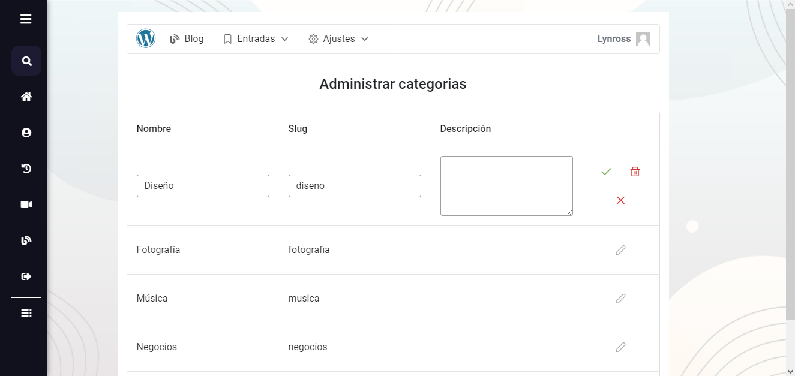;

**Versión Móvil**

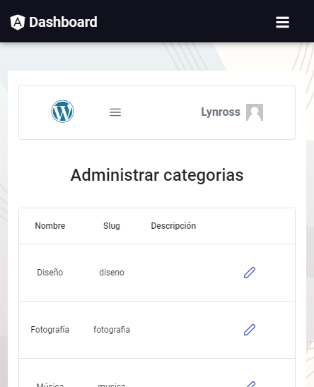;

</center>
&nbsp;

**Definición de los servicios utilizados para administrar las categorías**

```Typescript
import { HttpClient, HttpHeaders, HttpParams } from '@angular/common/http';
import { Injectable } from '@angular/core';
import { catchError } from 'rxjs/operators';
import { of, Observable } from 'rxjs'

import { WpCategory } from '../interfaces/wp-category.interface';
import { NewCategory } from '../interfaces/new-category.interface';

@Injectable({
  providedIn: 'root'
})
export class WordpressService {

  private urlWP: string = 'https://dev36.latiendasigueabierta.com/wp-json/wp/v2';

  constructor(private http: HttpClient) { }

  /**Getter de los headers */
  get wpHeaders() {
    return new HttpHeaders().set('Authorization', 'Bearer ' + localStorage.getItem('wp-token') || '');
  }
  /**
   * Función que toma la información del usuario que inició sesión
   * @returns Usuario de wordpress que inició sesión
   */
  getWPUser(): Observable<WordpressUser> {
    const url = `${this.urlWP}/users/me`;

    return this.http.post<WordpressUser>(url, null, { headers: this.wpHeaders })
      .pipe(
        catchError(err => of(err))
      );
  }
  /**
   * Función para obtener las categorías que está en wordpress
   * @returns Categorias almacenadas en wordpress 
   */
  getCategories(): Observable<WpCategory[]> {
    // per_page = número de categorías por petición ( si existen )
    const params = new HttpParams().set('per_page', 100);
    const url = `${this.urlWP}/categories?`;

    return this.http.get<WpCategory[]>(url, { params })
      .pipe(
        catchError(err => of(err))
      );
  }
  /**
   * Función que permite actualizar una categoría
   * @param body - Información nueva de la categoría
   * @param id - Identificador único de la categoría
   * @returns - Categoría actualizada
   */
  updateCategory(body: WpCategory, id: number): Observable<WpCategory> {
    const url = `${this.urlWP}/categories/${id}`;

    return this.http.put<WpCategory>(url, body, { headers: this.wpHeaders })
      .pipe(
        catchError(error => of(error))
      )
  }
  /**
   * Función que permite borrar una categoría
   * @param id - Id de la categoría a borrar
   * @returns - Categoría borrada
   */
  deleteCategory(id: number): Observable<WpCategory> {
    const params = new HttpParams().set('force', true);
    const url = `${this.urlWP}/categories/${id}`;

    return this.http.delete<WpCategory>(url, { headers: this.wpHeaders, params })
      .pipe(
        catchError(error => of(error))
      );
  }
  /**
   * Función para crear una nueva categoría
   * @param body - Objeto con la información de la nueva categoría
   * @returns - Información de la categoría creada
   */
  newCategory(body: object): Observable<NewCategory> {
    const url = `${this.urlWP}/categories`;

    return this.http.post<NewCategory>(url, body, { headers: this.wpHeaders })
      .pipe(
        catchError(err => {
          if (err.error.code == "term_exists") {
            return of({ error: err.error, msg: 'El slug proporcionado ya existe.' });
          }
          return of(err.error.message)
        })
      )
  }

}


```

**Implementación de los servicios utilizados para administrar las categorías**

```Typescript
import { Component, OnInit } from '@angular/core';
import Swal from 'sweetalert2';
import { switchMap } from 'rxjs/operators';
import { FormBuilder, FormGroup, Validators } from '@angular/forms';

import { WordpressService } from '../../services/wordpress.service';
import { WordpressUser } from '../../interfaces/logged-wp-user.interface';
import { WpCategory } from '../../interfaces/wp-category.interface';

@Component({
  selector: 'app-manage-categories',
  templateUrl: './manage-categories.component.html',
  styleUrls: ['./manage-categories.component.css']
})
export class ManageCategoriesComponent implements OnInit {
  // Variable en la que se guarda el usuario y se verifica que tenga los roles de administrador
  wpUser!: WordpressUser;
  // Variable para confirmar si tiene la sesión iniciada
  isWPLogged: boolean;
  // Se define el formulario donde se guarda la información para  administrar la categoría
  formCategory: FormGroup = this.formBuilder.group({
    name: ['', [Validators.required]],
    slug: ['', [Validators.required]],
    description: ['']
  });
  // Variables que sirven de banderas en la administración de las categorías
  isEditingRow: boolean = false;
  savingChanges: boolean;

  constructor(private wpService: WordpressService, private formBuilder: FormBuilder) { }

  categories: WpCategory[] = [];

  ngOnInit(): void {
    // Se llama el servicio para verificar las credenciales del usuario
    this.wpService.getWPUser().subscribe(user => {
      if (user["error"]) {
        this.isWPLogged = false;
        this.wpService.wpLogout();
      } else {
        this.wpUser = user;
        this.isWPLogged = true;
      }
    });
    // Se llama el servicio de las categorías y se almacenan
    this.wpService.getCategories().subscribe(categories => {
      categories.forEach(({ id, name, description, slug }) => {
        this.categories.push({ id, name, description, slug });
      });
    });
  }
  /**
   * Función que toma los vales de la categoría a editar y lo pone en el formulario a enviar para actualizar
   */
  onRowEditInit(category: WpCategory) {
    this.isEditingRow = true;
    this.formCategory.setValue({
      name: category.name,
      slug: category.slug,
      description: category.description
    });

  }
  /**
   * Función para guardar los nuevos datos de la categoría
   * @param category - Información antigua de la categoría
   */
  onRowEditSave(category: WpCategory) {
    this.savingChanges = true;
    this.wpService.updateCategory(this.formCategory.value, category.id)
      .pipe(
        switchMap(category => {
          if (category["error"]) {
            Swal.fire('Ha ocurrido un error', category["error"]["message"], 'error');
            return;
          } else {
            return this.wpService.getCategories();
          }
        })
      ).subscribe(categories => {
        this.categories = [];
        categories.forEach(({ id, name, description, slug }) => {
          this.categories.push({ id, name, description, slug });
        });
        this.isEditingRow = false;
        this.savingChanges = false;
        setTimeout(() => {
          this.savingChanges = undefined;
        }, 30000);
      });
  }
  /**
   * Función para cancelar la edición de una categoría
   * @param category - Información de la categoría
   * @param index - Índice de la categoría
   */
  onRowEditCancel(category: WpCategory, index: number) {
    this.isEditingRow = false;
    this.formCategory.reset();
  }
  /**
  * Función que recibe del hijo menu-wp las categorías más recientes 
  * @param categories - Categorías actualizadas
  */
  updateCategories(categories: WpCategory[]) {
    this.categories = [];
    categories.forEach(({ id, name, description, slug }) => {
      this.categories.push({ id, name, description, slug });
    });
  }

  /**
   * Función que permite borrar una categoria
   * @param category - Información de la categoría
   */
  onDeleteCategory(category: WpCategory) {
    this.savingChanges = true;
    this.wpService.deleteCategory(category.id).pipe(
      switchMap(category => {
        if (category["error"]) {
          Swal.fire('Ha ocurrido un error', category["error"]["message"], 'error');
          return;
        } else {
          return this.wpService.getCategories();
        }
      })
    ).subscribe(categories => {
      this.categories = [];
      categories.forEach(({ id, name, description, slug }) => {
        this.categories.push({ id, name, description, slug });
      });
      this.isEditingRow = false;
      this.savingChanges = false;
      setTimeout(() => {
        this.savingChanges = undefined;
      }, 30000);
    });
  }

}

```

### Interfaces Involucradas

``` Typescript
/**
 * Interfaz del perfil recibido desde la base de datos 
 */
export interface ProfileData {
    name: String,
    cc: String,
    address: String,
    dateOfBirth: String,
    city: String,
    department: String,
    country: String,
    ZIP: Number,
    profession: String,
    skills: String[],
    description: String,
    image: Photo
}

export interface Photo {
    id:string;
    tipo_imagen: string;
    imagePath: string;
}

```

```Typescript
/**
 * Interfaz del usuario de WordPress
 */
export interface WordpressUser {
    id:                 number;
    username:           string;
    name:               string;
    first_name:         string;
    last_name:          string;
    email:              string;
    url:                string;
    description:        string;
    link:               string;
    locale:             string;
    nickname:           string;
    slug:               string;
    roles:              string[];
    registered_date:    Date;
    capabilities:       { [key: string]: boolean };
    extra_capabilities: ExtraCapabilities;
    avatar_urls:        { [key: string]: string };
    meta:               any[];
    yoast_head:         string;
    yoast_head_json:    YoastHeadJSON;
    is_super_admin:     boolean;
    woocommerce_meta:   WoocommerceMeta;
    _links:             Links;
}

export interface Links {
    self:       Collection[];
    collection: Collection[];
}

export interface Collection {
    href: string;
}

export interface ExtraCapabilities {
    administrator: boolean;
}

export interface WoocommerceMeta {
    activity_panel_inbox_last_read:   string;
    activity_panel_reviews_last_read: string;
    categories_report_columns:        string;
    coupons_report_columns:           string;
    customers_report_columns:         string;
    orders_report_columns:            string;
    products_report_columns:          string;
    revenue_report_columns:           string;
    taxes_report_columns:             string;
    variations_report_columns:        string;
    dashboard_sections:               string;
    dashboard_chart_type:             string;
    dashboard_chart_interval:         string;
    dashboard_leaderboard_rows:       string;
    homepage_layout:                  string;
    homepage_stats:                   string;
    task_list_tracked_started_tasks:  string;
    help_panel_highlight_shown:       string;
    android_app_banner_dismissed:     string;
}

export interface YoastHeadJSON {
    title:        string;
    robots:       Robots;
    canonical:    string;
    og_locale:    string;
    og_type:      string;
    og_title:     string;
    og_url:       string;
    og_site_name: string;
    og_image:     OgImage[];
    twitter_card: string;
    schema:       Schema;
}

export interface OgImage {
    url: string;
}

export interface Robots {
    index:               string;
    follow:              string;
    "max-snippet":       string;
    "max-image-preview": string;
    "max-video-preview": string;
}

export interface Schema {
    "@context": string;
    "@graph":   Graph[];
}

export interface Graph {
    "@type":           string;
    "@id":             string;
    url?:              string;
    name?:             string;
    description?:      string;
    potentialAction?:  PotentialAction[];
    inLanguage?:       string;
    isPartOf?:         Breadcrumb;
    breadcrumb?:       Breadcrumb;
    itemListElement?:  ItemListElement[];
    image?:            Image;
    mainEntityOfPage?: Breadcrumb;
}

export interface Breadcrumb {
    "@id": string;
}

export interface Image {
    "@type":    string;
    "@id":      string;
    inLanguage: string;
    url:        string;
    contentUrl: string;
    caption:    string;
}

export interface ItemListElement {
    "@type":  string;
    position: number;
    name:     string;
    item?:    string;
}

export interface PotentialAction {
    "@type":        string;
    target:         string[] | TargetClass;
    "query-input"?: string;
}

export interface TargetClass {
    "@type":     string;
    urlTemplate: string;
}

```

```Typescript
/**
 * Interfaz de los archivos Media de WordPress 
 */
export interface Media {
    id: number;
    date?: Date;
    date_gmt?: Date;
    guid?: Caption;
    modified?: Date;
    modified_gmt?: Date;
    slug: string;
    status: string;
    type?: string;
    link?: string;
    title: Caption;
    author: number;
    comment_status: string;
    permalink_template?: string;
    generated_slug?: string;
    description?: Caption;
    caption?: Caption;
    alt_text?: string;
    media_type: string;
    mime_type?: string;
    post?: null;
    source_url?: string;
}

export interface Caption {
    raw: string;
    rendered: string;
}
```

```Typescript
/** 
 * Interfaz de la respuesta del backend en WordPress de una nueva categoría 
 */
export interface NewCategory {
    id:              number;
    count:           number;
    description?:     string;
    link:            string;
    name:            string;
    slug:            string;
    taxonomy:        string;
    parent:          number;
    meta:            any[];
    yoast_head:      string;
    yoast_head_json: YoastHeadJSON;
    _links:          Links;
}

export interface Links {
    self:           About[];
    collection:     About[];
    about:          About[];
    "wp:post_type": About[];
    curies:         Cury[];
}

export interface About {
    href: string;
}

export interface Cury {
    name:      string;
    href:      string;
    templated: boolean;
}

export interface YoastHeadJSON {
    title:          string;
    robots:         Robots;
    canonical:      string;
    og_locale:      string;
    og_type:        string;
    og_title:       string;
    og_description: string;
    og_url:         string;
    og_site_name:   string;
    twitter_card:   string;
    schema:         Schema;
}

export interface Robots {
    index:               string;
    follow:              string;
    "max-snippet":       string;
    "max-image-preview": string;
    "max-video-preview": string;
}

export interface Schema {
    "@context": string;
    "@graph":   Graph[];
}

export interface Graph {
    "@type":          string;
    "@id":            string;
    name?:            string;
    url?:             string;
    sameAs?:          any[];
    logo?:            Logo;
    image?:           Breadcrumb;
    description?:     string;
    publisher?:       Breadcrumb;
    potentialAction?: PotentialAction[];
    inLanguage?:      string;
    isPartOf?:        Breadcrumb;
    breadcrumb?:      Breadcrumb;
    itemListElement?: ItemListElement[];
}

export interface Breadcrumb {
    "@id": string;
}

export interface ItemListElement {
    "@type":  string;
    position: number;
    name:     string;
    item?:    string;
}

export interface Logo {
    "@type":    string;
    "@id":      string;
    inLanguage: string;
    url:        string;
    contentUrl: string;
    width:      number;
    height:     number;
    caption:    string;
}

export interface PotentialAction {
    "@type":        string;
    target:         string[] | TargetClass;
    "query-input"?: string;
}

export interface TargetClass {
    "@type":     string;
    urlTemplate: string;
}

```

```Typescript
/** 
 * Interfaz de las entradas
*/
export interface Post {
    id:                 number;
    date:               Date;
    date_gmt:           Date;
    guid:               GUID;
    modified:           Date;
    modified_gmt:       Date;
    password:           string;
    slug:               string;
    status:             string;
    type:               string;
    link:               string;
    title:              GUID;
    content:            Content;
    excerpt:            Content;
    author:             number;
    featured_media:     number;
    comment_status:     string;
    ping_status:        string;
    sticky:             boolean;
    template:           string;
    format:             string;
    meta:               any[];
    categories:         number[];
    tags:               any[];
    permalink_template: string;
    generated_slug:     string;
    yoast_head:         string;
    yoast_head_json:    YoastHeadJSON;
    _links:             Links;
}

export interface Links {
    self:                          About[];
    collection:                    About[];
    about:                         About[];
    author:                        AuthorElement[];
    replies:                       AuthorElement[];
    "version-history":             VersionHistory[];
    "wp:featuredmedia":            AuthorElement[];
    "wp:attachment":               About[];
    "wp:term":                     WpTerm[];
    "wp:action-publish":           About[];
    "wp:action-unfiltered-html":   About[];
    "wp:action-sticky":            About[];
    "wp:action-assign-author":     About[];
    "wp:action-create-categories": About[];
    "wp:action-assign-categories": About[];
    "wp:action-create-tags":       About[];
    "wp:action-assign-tags":       About[];
    curies:                        Cury[];
}

export interface About {
    href: string;
}

export interface AuthorElement {
    embeddable: boolean;
    href:       string;
}

export interface Cury {
    name:      string;
    href:      string;
    templated: boolean;
}

export interface VersionHistory {
    count: number;
    href:  string;
}

export interface WpTerm {
    taxonomy:   string;
    embeddable: boolean;
    href:       string;
}

export interface Content {
    raw:            string;
    rendered:       string;
    protected:      boolean;
    block_version?: number;
}

export interface GUID {
    rendered: string;
    raw:      string;
}

export interface YoastHeadJSON {
    title:                  string;
    robots:                 Robots;
    canonical:              string;
    og_locale:              string;
    og_type:                string;
    og_title:               string;
    og_description:         string;
    og_url:                 string;
    og_site_name:           string;
    article_published_time: Date;
    twitter_card:           string;
    twitter_misc:           TwitterMisc;
    schema:                 Schema;
}

export interface Robots {
    index:               string;
    follow:              string;
    "max-snippet":       string;
    "max-image-preview": string;
    "max-video-preview": string;
}

export interface Schema {
    "@context": string;
    "@graph":   Graph[];
}

export interface Graph {
    "@type":             string;
    "@id":               string;
    name?:               string;
    url?:                string;
    sameAs?:             any[];
    logo?:               Image;
    image?:              Image;
    description?:        string;
    publisher?:          BreadcrumbClass;
    potentialAction?:    PotentialAction[];
    inLanguage?:         string;
    contentUrl?:         string;
    width?:              number;
    height?:             number;
    isPartOf?:           BreadcrumbClass;
    primaryImageOfPage?: BreadcrumbClass;
    datePublished?:      Date;
    dateModified?:       Date;
    breadcrumb?:         BreadcrumbClass;
    itemListElement?:    ItemListElement[];
    author?:             BreadcrumbClass;
    headline?:           string;
    mainEntityOfPage?:   BreadcrumbClass;
    wordCount?:          number;
    commentCount?:       number;
    thumbnailUrl?:       string;
}

export interface BreadcrumbClass {
    "@id": string;
}

export interface Image {
    "@id":       string;
    "@type"?:    string;
    inLanguage?: string;
    url?:        string;
    contentUrl?: string;
    caption?:    string;
    width?:      number;
    height?:     number;
}

export interface ItemListElement {
    "@type":  string;
    position: number;
    name:     string;
    item?:    string;
}

export interface PotentialAction {
    "@type":        string;
    target:         string[] | TargetClass;
    "query-input"?: string;
    name?:          string;
}

export interface TargetClass {
    "@type":     string;
    urlTemplate: string;
}

export interface TwitterMisc {
    "Written by": string;
}

```

```Typescript
/**
 * Interfaz de la respuesta al iniciar sesión en WordPress 
 */
export interface UserWordpress {
    token:             string;
    user_email:        string;
    user_nicename:     string;
    user_display_name: string;
}
```

```Typescript
/** 
 * Interfaz del token recibido por WordPress 
 */
export interface ValidateWPToken {
    code: string;
    data: Data;
}

export interface Data {
    status: number;
}

```

<center>

## Menús


</center>

En está sección se busca detallar las funcionalidades de los menús utilizados en el proyecto

### Menú Publico

Este menú el usuario puede acceder sin tener que iniciar sesión previamente, se encuentra en las páginas de iniciar sesión y registrarse

<center>

**Versión Web**

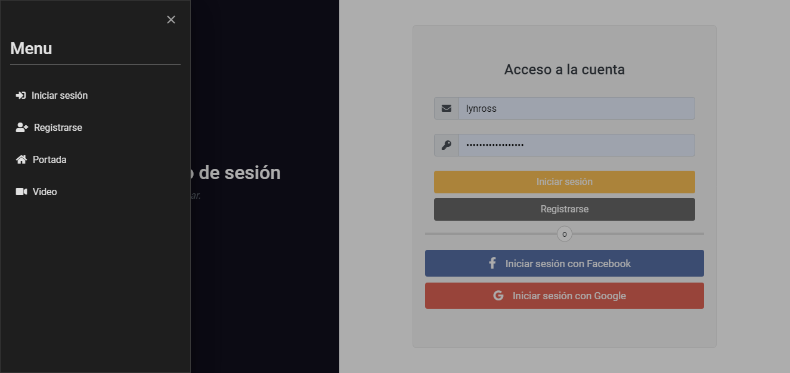

**Versión Móvil**

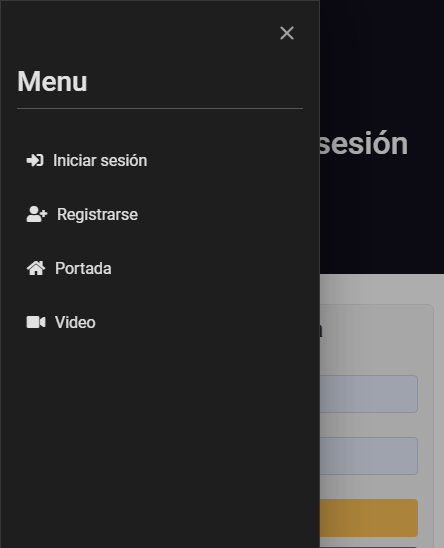

</center>

Para la implementación de este menú **se utilizó el modulo sidebar de [PrimeNG](https://www.primefaces.org/primeng/showcase/#/sidebar)**

### Menú de Dashboard

A este menú el usuario puede acceder una vez haya iniciado sesión en la aplicación, permite navegar a través de las rutas definidas en esta misma. Se realizó utilizando CSS(3)

<center>

**Versión Web**

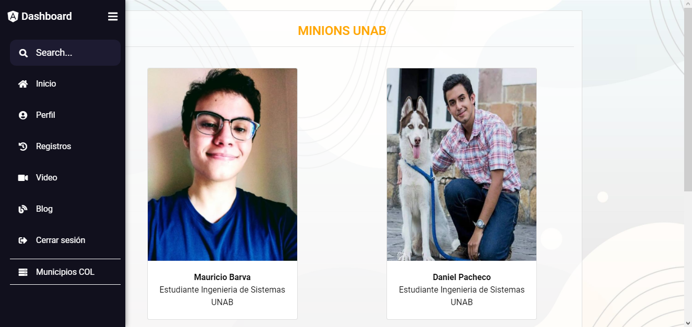

**Versión Móvil**

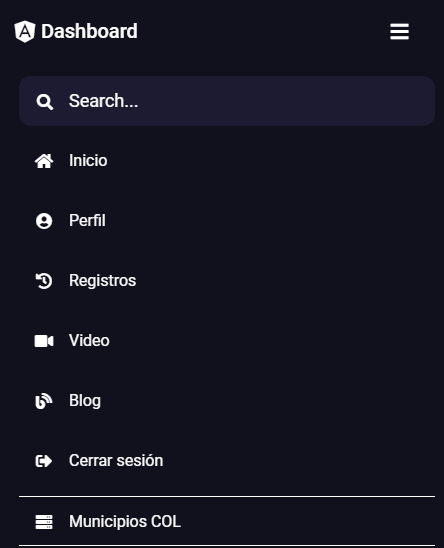

</center>

**Definición de los servicios utilizados para las funcionalidades del menú**

```Typescript
import { Injectable } from '@angular/core';

@Injectable({
  providedIn: 'root'
})
export class AuthService {

  // Variable que se pone en true cuando inicia sesión con Facebook o Google
  private isLogged: boolean = false;

 /**Metodo para borrar los tokens (cerrar sesion)*/
  logout() {
    localStorage.clear();
  }
}
```

**Implementación de los servicios utilizados para las funcionalidades del menú**

```Typescript
import { Component, OnInit } from '@angular/core';
import { Router } from '@angular/router';

import { AuthService } from '../../iniciar-sesion/services/auth.service';
import { SocialAuthService } from "angularx-social-login";

@Component({
  selector: 'app-sidebar',
  templateUrl: './sidebar.component.html',
  styleUrls: ['./sidebar.component.css']
})
export class SidebarComponent implements OnInit {

  loggedIn: boolean;

  constructor(
    private router: Router, 
    private authservice: AuthService, 
    private googleFbService: SocialAuthService
    ) { }

  ngOnInit(): void { }

  /**Funcion para cerrar sesion */
  logout() {
    if (this.authservice.isLoggedIn) {
      this.authservice.logout();
      // Metodo para cerrar sesión propio del modulo angularx-social-login
      this.googleFbService.signOut();
    }

    this.authservice.logout();
    this.router.navigateByUrl('/auth');
  }

  /**Funcion para la animacion del sidebar **/
  toggleBtn(btnBurger) {
    let sidebar = document.querySelector(".sidebar");
    let decision = sidebar.classList.toggle('active');
    let texts = document.querySelectorAll('.links_name');
    let tooltips = document.querySelectorAll('.tooltip');

    if (decision) {
      btnBurger.style.left = "90%";
      texts.forEach(element => {
        element.classList.add('showLinks')
      });
      tooltips.forEach(element => {
        element.classList.add('hideTooltip');
      });
    } else {
      btnBurger.style.left = "55%";
      texts.forEach(element => {
        element.classList.remove('showLinks')
      });
      tooltips.forEach(element => {
        element.classList.remove('hideTooltip');
      });
    }
  }
  /**Funcion que cambia el alto del sidebar cuando esta en dispositivos moviles */
  toggleHidden() {
    document.querySelector('.sidebar').classList.toggle('totalHeight');
  }

}

```

### Menú de WordPress


Este menú se encuentra en la página de Blog, le permite al usuario ver las entradas, categorias y administrarlas. Para la funcionalidad de administrar, el usuario debe iniciar sesión en WordPress y tener el rol de Administrador.

#### Menú Sin iniciar sesión


#### Menu de Administrador


#### Menú Cliente


**Definición de los servicios utilizados en el menú para manejar el menú del usuario y crear categorías**

```Typescript
import { HttpClient, HttpHeaders } from '@angular/common/http';
import { Injectable } from '@angular/core';
import { catchError } from 'rxjs/operators';
import { of, Observable } from 'rxjs'

import { NewCategory } from '../interfaces/new-category.interface';

@Injectable({
  providedIn: 'root'
})
export class WordpressService {

  private urlWP: string = 'https://dev36.latiendasigueabierta.com/wp-json/wp/v2';

  constructor(private http: HttpClient) { }
  /**Getter de los headers */
  get wpHeaders() {
    return new HttpHeaders().set('Authorization', 'Bearer ' + localStorage.getItem('wp-token') || '');
  }
  /**
   * Función para crear una nueva categoria
   * @param body - Objeto con la información de la nueva categoria
   * @returns - Información de la categoria creada
   */
  newCategory(body: object): Observable<NewCategory> {
    const url = `${this.urlWP}/categories`;

    return this.http.post<NewCategory>(url, body, { headers: this.wpHeaders })
      .pipe(
        catchError(err => {
          if (err.error.code == "term_exists") {
            return of({ error: err.error, msg: 'El slug proporcionado ya existe.' });
          }
          return of(err.error.message)
        })
      )
  }
  
  /**
   * Funcion para cerrar sesion en wordpress
   */
  wpLogout() {
    if (localStorage.getItem('wp-token')) {
      localStorage.removeItem('wp-token');
    }
  }

}

```

**Implementación de los servicios utilizados en el menú para manejar el menú del usuario y crear categorías**

```Typescript
import { Component, EventEmitter, Input, OnInit, Output, SimpleChanges, } from '@angular/core';
import { Router, ActivatedRoute } from '@angular/router';
import { MenuItem } from 'primeng/api';
import { FormGroup, FormBuilder, Validators } from '@angular/forms';
import Swal from 'sweetalert2';

import { WordpressService } from '../../services/wordpress.service';
import { WordpressUser } from '../../interfaces/logged-wp-user.interface';
import { WpCategory } from '../../interfaces/wp-category.interface';

@Component({
  selector: 'app-menu-wp',
  templateUrl: './menu-wp.component.html',
  styleUrls: ['./menu-wp.component.css']
})
export class MenuWpComponent implements OnInit {
  // Usuario que recibe del componente padre y su estado ( si está logeado o no )
  @Input() wpUser: WordpressUser;
  @Input() isWPLogged: boolean;
  // Variables de menú
  loading: boolean = undefined;
  items: MenuItem[];
  load: boolean = false;
  linkTo: string;
  displayResponsive: boolean = false;
  // Evento que emite al padre las categorías en caso de que se cree una nueva
  @Output() onUpdateCategories: EventEmitter<WpCategory[]> = new EventEmitter();
  // Definición del formulario que recoge la información para crear una nueva categoría
  formCategory: FormGroup = this.formBuilder.group({
    name: ['', [Validators.required]],
    slug: ['', [Validators.required]],
    description: ['']
  });

  constructor(
    private wpService: WordpressService,
    private router: Router,
    private formBuilder: FormBuilder,
    private route: ActivatedRoute
  ) { }

  ngOnInit(): void {
    // Cambia la ruta de iniciar sesión en wordpress dependiendo de la página en la que el usuario se encuentre
    this.route.params.subscribe(({ slug }) => {
      if (slug) {
        this.linkTo = '/dashboard/blog/iniciar-sesion-wp';
      } else {
        this.linkTo = './iniciar-sesion-wp';
      }
    });
  }

  //Revisa si el usuario que pasa el componente padre blog ya le paso la información del usuario y si inició sesión
  ngOnChanges(changes: SimpleChanges) {
    if (changes.isWPLogged.currentValue != undefined) {
      this.loading = false;
    }

    if (changes.wpUser.currentValue != undefined) {
      this.loading = false;
      if (this.wpUser["capabilities"]["administrator"]) {
        this.items = this.adminMenu();
      } else {
        this.items = this.customerMenu();
      }
    }
  }

  /**Funcion que permite o no ir a la pagina de agregar post */
  addPost() {
    if (this.wpUser["capabilities"]["administrator"]) {
      this.router.navigateByUrl('dashboard/blog/anadir-entrada');
    }
    else if (!this.wpUser) {
      this.router.navigateByUrl('dashboard/blog/iniciar-sesion-wp');
    } else {
      this.router.navigateByUrl('dashboard/blog');
    }
  }

  /**Metodo para cerrar sesion en wordpress */
  signoutWP() {
    this.wpService.wpLogout();
    this.router.navigateByUrl('dashboard/blog');
    if (this.router.url == '/dashboard/blog') {
      window.location.reload();
    }
  }

  /**
   * Funcion para agregar una nueva categoría
   */
  newCategory() {
    this.wpService.newCategory(this.formCategory.value).subscribe(category => {
      if (category["error"]) {
        Swal.fire('Oops', category["msg"], 'error');
        return false;
      }
      if (
        this.router.url == '/dashboard/blog/anadir-entrada'
        || this.router.url.indexOf('editar-entrada') > -1
        || this.router.url.indexOf('administrar-categorias') > -1
      ) {
        this.wpService.getCategories().subscribe(categories => this.onUpdateCategories.emit(categories));
      }
      Swal.fire('Todo en orden!', 'La categoria ha sido añadida con exito!', 'success');
    });
  }

  /**Funcion para mostrar el modal de nueva categoria */
  showResponsiveDialog() {
    this.displayResponsive = true;
  }

  /**Funcion que retorna el menu del administrador */
  adminMenu() {
    return [
      {
        label: 'Blog',
        icon: 'fas fa-blog',
        routerLink: '/dashboard/blog'
      },
      {
        label: 'Entradas',
        icon: 'pi pi-bookmark',
        items: [{
          label: 'Añadir entrada',
          icon: 'pi pi-fw pi-plus',
          command: () => {
            this.addPost();
          }
        },
        {
          label: 'Categorías',
          icon: 'pi pi-external-link',
          items: [
            {
              label: 'Añadir',
              icon: 'pi pi-fw pi-plus',
              command: () => {
                this.showResponsiveDialog();
              }
            },
            {
              label: 'Administrar',
              icon: 'pi i pi-cog',
              routerLink: '/dashboard/blog/administrar-categorias'
            }
          ]
        }
        ]
      },
      {
        label: 'Ajustes',
        icon: 'pi pi-cog',
        items: [
          {
            label: 'Se tu propio jefe',
            icon: 'pi pi-user-edit',
            command: () => {
              Swal.fire('Empanadas', 'Por el momento esta opcion es solo decoración!', 'info')
            }
          },
          {
            separator: true
          },
          {
            label: 'Cerrar sesión',
            icon: 'pi pi-sign-out',
            command: () => {
              this.signoutWP();
            }
          }

        ]
      }
    ];
  }
  /**Funcion que retorna el menu del cliente o usuario basico */
  customerMenu() {
    return [
      {
        label: 'Blog',
        icon: 'fas fa-blog',
        routerLink: '/dashboard/blog'
      },
      {
        label: 'Ajustes',
        icon: 'pi pi-cog',
        items: [
          {
            label: 'Se tu propio jefe',
            icon: 'pi pi-user-edit',
            command: () => {
              Swal.fire('Empanadas', 'Por el momento esta opcion es solo decoración!', 'info')
            }
          },
          {
            separator: true
          },
          {
            label: 'Cerrar sesión',
            icon: 'pi pi-sign-out',
            command: () => {
              this.signoutWP();
            }
          }

        ]
      }
    ];
  }

}
```


### Interfaces Involucradas

```Typescript
/**Interfaz utilizada para crear una categoría */
export interface WpCategory {
    id: number;
    name: string;
    description?: string;
    slug?: string;
}
```

<center>

## Guards

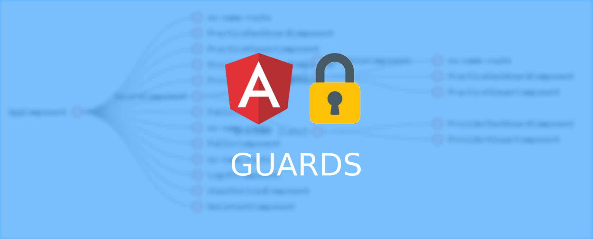

</center>

Esta sección tiene como objeto principal documentar los guards utilizados en la aplicación para proteger las rutas. Los Guards en Angular sirven para proteger las rutas, evitar que estas se activen o se carguen los modulos de estas ( si se usa lazyload ).

### Token aplicación

Este token es generado luego de iniciar sesión con una cuenta creada por medio de la aplicación o utilizando una cuenta de Facebook o Google, es validado mientras el usuario navega por las distintas rutas de la aplicación, si el token no es valido se cierra sesión automaticamente. 

#### Validar token creado por la aplicación

**Definición del servicio utilizado para validar el token creado por una cuenta propia de la aplicación**

```Typescript
import { HttpClient, HttpHeaders } from '@angular/common/http';
import { Injectable } from '@angular/core';
import { AuthResponse } from '../interfaces/auth.interface';
import { catchError, map } from 'rxjs/operators';
import { of, Observable, pipe } from 'rxjs';

@Injectable({
  providedIn: 'root'
})
export class AuthService {

  private baseUrl: string = 'https://dev36-auth.herokuapp.com';
  private _user!: (AuthResponse | SocialUser | any );

  /**Getter del usuario*/
  get user() {
    return { ... this._user }
  }

  constructor(private httpClient: HttpClient) { }

  /**Metodo para validar token creado utilizando jwt*/
  validateToken(): Observable<boolean> {
    const url = `${this.baseUrl}/renew`;
    // Se toma el token del localStorage
    const headers = new HttpHeaders().set('x-token', localStorage.getItem('token') || '');

    return this.httpClient.get<AuthResponse>(url, { headers })
      .pipe(
        map(resp => {
          this.setTokenAndUser(resp);
          return resp.ok;
        }),
        catchError(err => of(false))
      );
  }
  /**Metodo para borrar los tokens (cerrar sesion)*/
  logout() {
    localStorage.clear();
  }

  /**Metodo para colocar el token que me devuelve jwt para validar el inicio de sesion*/
  setTokenAndUser(resp: AuthResponse) {
    localStorage.setItem('provider', 'ownLogin');
    localStorage.setItem('token', resp.token!);
    this._user = resp;
  }

}

```


**Implementacion del servicio utilizado para validar el token creado por una cuenta propia de la aplicación en el Guard**

```Typescript
import { Injectable } from '@angular/core';
import { ActivatedRouteSnapshot, CanActivate, CanLoad, Router, RouterStateSnapshot } from '@angular/router';
import { SocialAuthService } from 'angularx-social-login';
import { Observable } from 'rxjs';
import { tap } from 'rxjs/operators';
import { AuthService } from '../iniciar-sesion/services/auth.service';


@Injectable({
  providedIn: 'root'
})
export class ValidateTokenGuard implements CanActivate, CanLoad {

  constructor(private authService: AuthService, private router: Router,
    private socialAuthService: SocialAuthService) { }

  /** Los metodos canActivate (Activar rutas) canLoad (Mostrar contenido de las rutas)
   dependiendo si el usuario inicia sesion con una cuenta creada por medio de la app
  o se autentico con facebook y google, validan si las rutas deben ser activadas y mostradas */
  canActivate(route: ActivatedRouteSnapshot, state: RouterStateSnapshot): Observable<boolean> | boolean {

    console.log('Can activate');
    // Se define el object literal para cerrar sesión
    let logoutObject = {
      "LOGOUT": (ok: boolean) => {
        if (!ok || !localStorage.getItem('token')) {
          if (this.authService.isLoggedIn) {
            this.socialAuthService.signOut();
          }
          this.authService.logout();
          this.router.navigateByUrl('/auth');
        }
      }
    }

    // Se define el object literal con la propiedad de ingreso por cuenta creada por la app
    let routesObject = {
      "ownLogin": () => {
        return this.authService.validateToken().pipe(
          tap(ok => {
            logoutObject["LOGOUT"](!!ok);
          })
        );
      },
      "DEFAULT": () => {
        logoutObject["LOGOUT"](!!false);
      }
    }

    return (!!localStorage.getItem('provider')) ? routesObject[localStorage.getItem('provider')]() : routesObject["DEFAULT"]();
    
  }

  canLoad(): Observable<boolean> | boolean {
    console.log('Can load');
    // Se define el object literal para cerrar sesión
    let logoutObject = {
      "LOGOUT": (ok: boolean) => {
        if (!ok || !localStorage.getItem('token')) {
          if (this.authService.isLoggedIn) {
            this.socialAuthService.signOut();
          }
          this.authService.logout();
          this.router.navigateByUrl('/auth');
        }
      }
    }
    // Se define el object literal con la propiedad de ingreso por cuenta creada por la app
    let routesObject = {
      "ownLogin": () => {
        return this.authService.validateToken().pipe(
          tap(ok => {
            logoutObject["LOGOUT"](!!ok);
          })
        );
      },
      "DEFAULT": () => {
        console.log('default');
        logoutObject["LOGOUT"](!!false);
      }

    }
    // Se toma el proveedor almacenado en el localStorage, si no hay manda el default
    return (!!localStorage.getItem('provider')) ? routesObject[localStorage.getItem('provider')]() : routesObject["DEFAULT"]();
    
  }
}

```

#### Validar token creado por Google o Facebook

Este token es lo genera Facebook o Google luego de iniciar sesión con una cuenta de ellos, es validado mientras el usuario navega por las distintas rutas de la aplicación, si el token no es valido se cierra sesión automaticamente. 

**Definición del servicio utilizado para validar el token creado por Facebook o Google**

```Typescript
import { HttpClient, HttpHeaders } from '@angular/common/http';
import { Injectable } from '@angular/core';
import { AuthResponse } from '../interfaces/auth.interface';
import { catchError, map, tap } from 'rxjs/operators';
import { of, Observable, pipe } from 'rxjs';

import { SocialAuthService } from "angularx-social-login";
import { SocialUser } from "angularx-social-login";


@Injectable({
  providedIn: 'root'
})
export class AuthService {

  private baseUrl: string = 'https://dev36-auth.herokuapp.com';
  private _user!: (AuthResponse | SocialUser | any );
  private isLogged: boolean = false;

  /**Getter del usuario*/
  get user() {
    return { ... this._user }
  }

  /**Getter del estado del usuario si inicia sesion con google y facebook*/
  get isLoggedIn() {
    return this.isLogged;
  }

  constructor(private httpClient: HttpClient, private authService: SocialAuthService) { }

  /**Object Literal que recibe una variable y permite validar el token de google o facebook*/
  validateAuthGoogleFb(decision: string): Observable<boolean> {
    let objectSocialAuth = {
      "GOOGLE": () => {
        const url = `${this.baseUrl}/validateToken`;
        const headers = new HttpHeaders().set('token-auth', localStorage.getItem('token') || '');
        return this.httpClient.get<AuthResponse>(url, { headers })
          .pipe(
            map(resp => {
              this._user = resp;
              return resp.ok;
            }),
            catchError(err => of(false, this.isLogged = false))
          );
      },
      "FACEBOOK": () => {
        const url = `${this.baseUrl}/auth/facebook/token?access_token=${localStorage.getItem('token') || ''}`;
        return this.httpClient.get<AuthResponse>(url)
          .pipe(
            map(resp => {
              this._user = resp;
              return resp.ok;
            }),
            catchError(err => of(false, this.isLogged = false))
          );
      },
      "DEFAULT": () => {
        return of(false, this.isLogged = false);
      }
    }

    return objectSocialAuth[decision]() || objectSocialAuth["DEFAULT"]();
  }

  /**Metodo para borrar los tokens (cerrar sesion)*/
  logout() {
    localStorage.clear();
  }

  /**Metodo para saber si el usuario esta logeado en la app con Facebook o Google*/
  loginGoogle() {
    // authState es una función que brinda el  modulo de angularx-social-login
    // Lo que hace es suscribirse al estado del usuario, si está conectado manda la información del usuario
    // De lo contrario manda null
    return this.authService.authState.pipe(
      tap(user => {
        this._user = user;
        this.isLogged = (user != null);

        if ((user != null)) {
          if (user.provider == "GOOGLE") {
            localStorage.setItem('provider', 'GOOGLE');
            localStorage.setItem('token', user.idToken);
          }

          if (user.provider == "FACEBOOK") {
            localStorage.setItem('provider', 'FACEBOOK');
            localStorage.setItem('token', user.authToken);
          }
        }
      }), catchError(err => of(false, this.isLogged = false))
    )
  }

}

```

**Implementación del servicio utilizado para validar el token creado por Facebook o Google en el Guard**

```Typescript
import { Injectable } from '@angular/core';
import { ActivatedRouteSnapshot, CanActivate, CanLoad, Router, RouterStateSnapshot } from '@angular/router';
import { SocialAuthService } from 'angularx-social-login';
import { Observable } from 'rxjs';
import { tap } from 'rxjs/operators';

import { AuthService } from '../iniciar-sesion/services/auth.service';


@Injectable({
  providedIn: 'root'
})
export class ValidateTokenGuard implements CanActivate, CanLoad {

  constructor(private authService: AuthService, private router: Router,
    private socialAuthService: SocialAuthService) { }

  /* Los metodos canActivate (Activar rutas) canLoad (Mostrar contenido de las rutas)
   dependiendo si el usuario inicia sesion con una cuenta creada por medio de la app
  o se autentico con facebook y google, validan si las rutas deben ser activadas y mostradas */
  canActivate(route: ActivatedRouteSnapshot, state: RouterStateSnapshot): Observable<boolean> | boolean {

    console.log('Can activate');
    // Se define el object literal para cerrar sesión
    let logoutObject = {
      "LOGOUT": (ok: boolean) => {
        if (!ok || !localStorage.getItem('token')) {
          if (this.authService.isLoggedIn) {
            this.socialAuthService.signOut();
          }
          this.authService.logout();
          this.router.navigateByUrl('/auth');
        }
      }
    }
    // Se define el object literal con los proveedores Facebook o Google
    let routesObject = {
      "FACEBOOK": () => {
        return this.authService.validateAuthGoogleFb(localStorage.getItem('provider') || '').pipe(
          tap(ok => {
            logoutObject["LOGOUT"](!!ok);
          })
        );
      },
      "GOOGLE": () => {
        return this.authService.validateAuthGoogleFb(localStorage.getItem('provider') || '').pipe(
          tap(ok => {
            logoutObject["LOGOUT"](!!ok);
          })
        );
      },
      "DEFAULT": () => {
        logoutObject["LOGOUT"](!!false);
      }

    }
    // Se toma el proveedor almacenado en el localStorage, si no hay manda el default
    return (!!localStorage.getItem('provider')) ? routesObject[localStorage.getItem('provider')]() : routesObject["DEFAULT"]();
    
  }

  canLoad(): Observable<boolean> | boolean {
    console.log('Can load');

    
    console.log('Can activate');
    // Se define el object literal para cerrar sesión
    let logoutObject = {
      "LOGOUT": (ok: boolean) => {
        if (!ok || !localStorage.getItem('token')) {
          if (this.authService.isLoggedIn) {
            this.socialAuthService.signOut();
          }
          this.authService.logout();
          this.router.navigateByUrl('/auth');
        }
      }
    }
    // Se define el object literal con los proveedores Facebook o Google
    let routesObject = {
      "FACEBOOK": () => {
        return this.authService.validateAuthGoogleFb(localStorage.getItem('provider') || '').pipe(
          tap(ok => {
            logoutObject["LOGOUT"](!!ok);
          })
        );
      },
      "GOOGLE": () => {
        return this.authService.validateAuthGoogleFb(localStorage.getItem('provider') || '').pipe(
          tap(ok => {
            logoutObject["LOGOUT"](!!ok);
          })
        );
      },
      "DEFAULT": () => {
        logoutObject["LOGOUT"](!!false);
      }

    }
    // Se toma el proveedor almacenado en el localStorage, si no hay manda el default
    return (!!localStorage.getItem('provider')) ? routesObject[localStorage.getItem('provider')]() : routesObject["DEFAULT"]();
  }
  
}

```

### Token enviado por WordPress

Este token es generado por la API REST de WordPress cuando el usuario inicia sesión y almacenado en el localStorage para las validaciones en el momento que el usuario quiera administrar las entradas o las categorías.
Para la autenticación se utilizo **JWT Authentication for WP REST API**, puedes encontrar la documentación oficial [aquí](https://wordpress.org/plugins/jwt-authentication-for-wp-rest-api/)

**Definición del servicio utilizado para validar el token de WordPress**

```Typescript
import { HttpClient, HttpHeaders } from '@angular/common/http';
import { Injectable } from '@angular/core';
import { catchError, map, tap } from 'rxjs/operators';
import { of, Observable } from 'rxjs'

import { WordpressUser } from '../interfaces/logged-wp-user.interface';
import { ValidateWPToken } from '../interfaces/wp-token.interface';

@Injectable({
  providedIn: 'root'
})
export class WordpressService {

  private urlWP: string = 'https://dev36.latiendasigueabierta.com/wp-json/wp/v2';
  private urlWpToken: string = 'https://dev36.latiendasigueabierta.com/wp-json/jwt-auth/v1/token';

  constructor(private http: HttpClient) { }
  /**Getter de los headers */
  get wpHeaders() {
    return new HttpHeaders().set('Authorization', 'Bearer ' + localStorage.getItem('wp-token') || '');
  }
  /**
   * Funcion para validar el token de wordpress
   * @returns - Observable true si el token es valido, de lo contrario observable false
   */
  validateWpToken(): Observable<boolean> {
    const url = `${this.urlWpToken}/validate`;

    return this.http.post<ValidateWPToken>(url, null, { headers: this.wpHeaders })
      .pipe(
        map(resp => {
          if (resp.code === 'jwt_auth_valid_token') {
            return true;
          }
          return false;
        }),
        catchError(err => of(false))
      );
  }
  /**
   * Funcion que toma la informacion del usuario que inicio sesion
   * @returns Usuario de wordpress que inicio sesion
   */
  getWPUser(): Observable<WordpressUser> {
    const url = `${this.urlWP}/users/me`;

    return this.http.post<WordpressUser>(url, null, { headers: this.wpHeaders })
      .pipe(
        catchError(err => of(err))
      );
  }
  /**
   * Funcion para cerrar sesion en wordpress
   */
  wpLogout() {
    if (localStorage.getItem('wp-token')) {
      localStorage.removeItem('wp-token');
    }
  }
}

```

**Implementación del servicio utilizado para validar el token de WordPress en el Guard**

```Typescript
import { Injectable } from '@angular/core';
import { CanActivate, Router } from '@angular/router';
import { Observable } from 'rxjs';
import { tap } from 'rxjs/operators';

import { WordpressService } from '../usuarios/pages/blog/services/wordpress.service';

@Injectable({
  providedIn: 'root'
})
export class TokenWpGuard implements CanActivate {

  constructor(private wpService: WordpressService, private router: Router) { }

  canActivate(): Observable<boolean> | boolean {
    console.log('Can Activate New Post')
    return this.wpService.validateWpToken()
      .pipe(
        tap(logged => {
          // Si la respuesta del observable es false ejecuta lo siguiente
          if (!logged) {
            this.wpService.wpLogout();
            this.router.navigateByUrl('dashboard/blog/iniciar-sesion-wp');
          } else {
            // Si la respuesta es true ejecuta lo siguiente
            this.wpService.getWPUser().subscribe(user => {
              if (!user["capabilities"]["administrator"]) {
                this.router.navigateByUrl('dashboard/blog');
              }
            })
          }
        })
      )
  }

}

```

### Interfaces Involucradas 

```Typescript
/**
 *  Interfaz de la respuesta que me devuelve la base de datos 
 */
export interface AuthResponse {
    ok: boolean;
    token: string;
    user: User;
}

/**
 * Interfaz del usuario de angulax-social-login 
 */
export declare class SocialUser {
    provider: string;
    id: string;
    email: string;
    name: string;
    photoUrl: string;
    firstName: string;
    lastName: string;
    authToken: string;
    idToken: string;
    authorizationCode: string;
    response: any;
}


/** 
 * Interfaz del token recibido por WordPress 
 */
export interface ValidateWPToken {
    code: string;
    data: Data;
}

export interface Data {
    status: number;
}


```