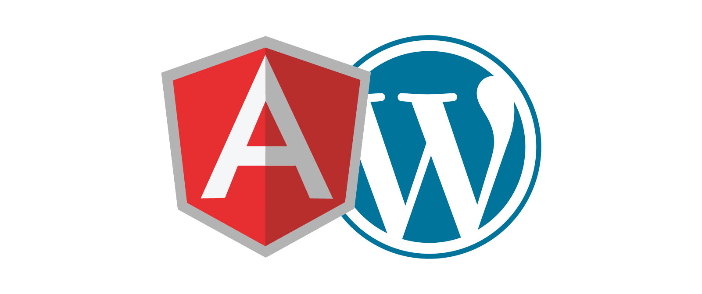

# Documentación del proyecto Angular con Wordpress

## Introducción

Esta es la documentación del proyecto [**Dashboard | Practicas II Semestre UNAB**](https://dev36-auth.herokuapp.com/), realizado
en la empresa **A&A Soluciones TIC**, utilizando MKDOCS para publicarlo
en ReadTheDocs. En este proyecto se utilizó Angular para el Frontend, en la parte del backend se utilizó NodeJS, TypeORM con base de datos MySQL.  También se hizo uso de la [API REST de los departamentos y municipios de Colombia](frontend#perfil) y la [API REST de WordPres](frontend#blog).

## Contenido

* [Frontend](frontend.md) 
    * [Introducción](frontend#introducción)
    * [Versión de Angular](frontend#version-de-angular)
        * [Versión de los paquetes](frontend#version-de-los-paquetes)
    * [Páginas publicas](frontend#paginas-publicas)
        * [Registrarse](frontend#registrarse)
            * [Código utilizado para crear un usuario](frontend#codigo-utilizado-para-crear-un-usuario)
        * [Iniciar sesión](frontend#iniciar-sesion)
            * [Inicio de sesión por medio de la aplicación](frontend#inicio-de-sesion-por-medio-de-la-aplicacion)
            * [Inicio de sesión con redes sociales](frontend#inicio-de-sesion-con-redes-sociales)
            * [Inicio de sesión con Facebook o Google](frontend#inicio-de-sesion-con-facebook-o-google)
        * [Interfaces Involucradas](frontend#interfaces-involucradas)
    * [Páginas privadas](frontend#paginas-privadas)
        * [Inicio](frontend#inicio)
        * [Perfil](frontend#perfil)
        * [Registros](frontend#registros)
        * [Video](frontend#videos)
        * [Blog](frontend#blog)
            * [Todas las entradas](frontend#todas-las-entradas)
            * [Ver entrada específica](frontend#ver-entrada-especifica)
            * [Iniciar sesión en WordPress](frontend#iniciar-sesion-en-wordpress)
            * [Crear entrada](frontend#crear-entrada)
            * [Editar entrada](frontend#editar-entrada)
            * [Administrar categorías](frontend#administrar-categorias)
        * [Interfaces Involucradas](frontend#interfaces-involucradas)
    * [Menús](frontend#menus)
        * [Menú Publico](frontend#menu-publico)
        * [Menú de Dashboard](frontend#menu-de-dashboard)
        * [Menú de WordPress](frontend#menu-de-wordpress)
            * [Menú Sin Iniciar Sesión](frontend#menu-sin-iniciar-sesion)
            * [Menú de Administrador](frontend#menu-de-administrador)
            * [Menú Cliente](frontend#menu-cliente)
        * [Interfaces Involucradas](frontend#interfaces-involucradas)
    * [Guards](frontend#guards)
        * [Token aplicación](frontend#token-aplicacion)
            * [Validar token creado por la aplicación](frontend#validar-token-creado-por-la-aplicacion)
            * [Validar token creado por Google o Facebook](frontend#validar-token-creado-por-google-o-facebook)
        * [Token enviado por WordPress](frontend#token-enviado-por-wordpress)

* [Backend](backend.md)
    * [Introducción](backend#introduccion)
    * [Versión de Node](backend#version-de-node)
    * [Archivo index.ts](backend#archivo-indexts)
    * [Controladores](backend#controladores)
    * [Entidades](backend#entidades)
        * [Entidad de los usuarios creados por medio de la aplicación](backend#entidad-de-los-usuarios-creados-por-medio-de-la-aplicacion)
        * [Entidad de los usuarios creados por medio de Google o Facebook](backend#entidad-de-los-usuarios-creados-por-medio-de-google-o-facebook)
        * [Entidad del perfil de los usuarios](backend#entidad-del-perfil-de-los-usuarios)
    * [Helpers](backend#helpers)
        * [Borrar imagen de perfil del usuario](backend#borrar-imagen-de-perfil-del-usuario)
        * [Generar JWT](backend#generar-jwt)
        * [Información del usuario](backend#informacion-del-usuario)
    * [Middlewares](backend#middlewares)
        * [Subir imagén de perfil](backend#subir-imagen-de-perfil)
        * [Validar campos de los formularios de inicio de sesión y registro](backend#validar-campos-de-los-formularios-de-inicio-de-sesion-y-registro)
        * [Validar JWT](backend#validar-jwt)
    * [Carpeta Public](backend#carpeta-public)
    * [Rutas](backend#rutas)
    * [Carpeta de imágenes de los perfiles](backend#carpeta-de-imagenes-de-los-perfiles)
    

## Repositorio

Para el manejo de las versiones del proyecto se utilizó Git y GitHub, puedes ver el repositorio haciendo
click [aquí](https://github.com/dev36aiatic/primerosPasosAngular)

### Servidor de desarrollo Frontend

Pasos para levantar el servidor de desarrollo de Angular:

1. `git clone https://github.com/dev36aiatic/primerosPasosAngular.git`
2.  Abrir consola de comandos sobre la carpeta del proyecto clonado en el paso anterior
2. `npm install`  - Instala las dependecias del proyecto de Angular
3. `ng serve -o` - Abre el proyecto una vez esté listo

#### Build de producción
Para generar la build de producción debes abrir la consola de comandos sobre la carpeta del proyecto de angular
y ejecutar el comando `ng build --configuration production`. Esto creará los archivos en la siguiente ruta.

    Angular                     # La carpeta que contiene del proyecto de Angular clonado
        dist/                   
            Angular/
                    index.html  # El index.html del proyecto
                    ...         # Otros archivos del proyecto como el script, estilos css y fuentes.

Una vez creados estos archivos puedes utilizarlos de la forma que desees.

### Servidor de desarrollo Backend

1. `git clone https://github.com/dev36aiatic/primerosPasosAngular.git`
2.  Abrir consola de comandos sobre la carpeta backend que está dentro del proyecto clonado en el paso anterior
3.  `npm install`  - Instala las dependecias del proyecto de NodeJS
4.  Configurar la conexión a la base de datos en el archivo `ormconfig.json`
5.  Configurar las variables de entorno en el archivo .env
5.  `npm run dev` - Corre el servidor del backend

